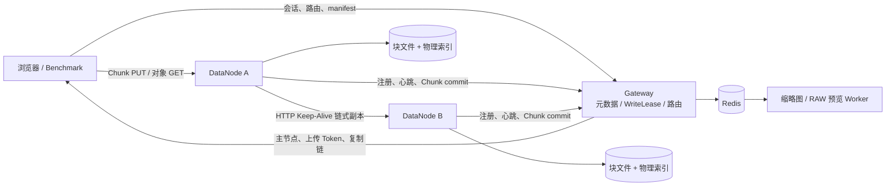

# miniDriver

> 基于 C++17 的分布式对象存储与多媒体数据服务原型。

miniDriver 面向 RAW 照片、视频、文档等大对象的上传、存储、下载与管理场景。系统将 Gateway
控制面与 DataNode 数据面分离：Gateway 负责元数据、路由、写入租约和提交；客户端根据路由直接向
DataNode 流式上传 4 MiB Chunk，文件字节不经过 Gateway。

当前项目处于 V4：重点是数据面正确性、资源治理、可观测性与性能验证，而非生产级高可用对象存储。

## 核心能力

- **分布式对象存储**：Gateway + 多 DataNode 多进程部署，链式双副本写入。
- **可靠上传**：4 MiB 分块、SHA-256 校验、断点续传、动态副本路由、HMAC 上传令牌、幂等 Chunk/File commit。
- **资源治理**：Gateway `WriteLease` 预占，DataNode 本地上传/下载准入；满载返回 `503 + Retry-After`。
- **网络与存储**：基于 `epoll` 的 Reactor/Multi-Reactor，流式 HTTP Body、pause/resume 背压、有界磁盘写队列、固定 BlockPool、`sendfile` 下载。
- **副本与内存优化**：HTTP/1.1 Keep-Alive 副本连接池，以及供磁盘写与副本发送共同持有的 `SharedBodyBlock`。
- **多媒体服务**：Redis 媒体任务、JPEG 缩略图、RAW 内嵌预览图和派生对象上传。
- **Web 管理界面**：目录浏览、分块上传、上传进度与失败重试、下载、删除、缩略图与 RAW 预览；静态页面位于 `www-v2/`。
- **性能观测**：文件/Chunk P50/P95/P99、控制面时延、磁盘 pause、BlockPool 峰值、EventLoop lag、输出队列与副本连接指标。

## 系统架构



上传数据路径：

```text
TCP input buffer
  → SharedBodyBlock（固定 BlockPool）
      ├─ DiskWriteExecutor → pwrite → 本地物理索引
      └─ ReplicaUploadPipe → DataNode 副本节点
```

当 BlockPool 或磁盘队列到达高水位时，DataNode 暂停 `EPOLLIN`；资源恢复后继续读取，防止慢磁盘或
慢副本将内存队列无限放大。

## 目录说明

```text
include/             公共头文件：network、http、gateway、DataNode、storage、media
src/                 实现与各进程入口
  gateway/           Gateway 控制面
  DataNode/          DataNode 数据面、磁盘写入、复制
  network/           EventLoop、Channel、TcpConnection、TcpServer/Client
  http/              HTTP 解析、异步客户端、持久会话
  media/             Redis 媒体任务、缩略图、RAW 预览
  benchmark/         C++ 本地压测客户端
www-v2/              Web 管理界面静态资源
test/                CTest 回归测试
tools/               本地压测集群启动、停止、观测汇总工具
docs/                设计、压测与性能分析报告
```

## 环境依赖

- Linux（使用 `epoll`、`sendfile` 等 Linux 接口）
- CMake >= 3.10、支持 C++17 的 GCC/Clang、pthread
- OpenSSL / libcrypto
- LevelDB
- yaml-cpp、spdlog
- hiredis + Redis（Gateway 媒体任务与 Worker）
- LibRaw（RAW 预览功能）
- `curl`（本地集群启动脚本的健康检查）

Ubuntu/Debian 上的包名会随发行版变化；请根据 CMake 的 `find_package` / `find_library` 输出安装对应的
开发包。UI 测试另需 Python `playwright`，但它不是数据面运行时依赖。

## 构建

```bash
cmake -S . -B build -DCMAKE_BUILD_TYPE=RelWithDebInfo
cmake --build build -j2
```

主要可执行文件位于 `build/bin/`：

```text
minikv_v2_gateway             Gateway
minikv_v2_datanode            DataNode
minikv_v2_bench               本地压测客户端
minikv_v2_thumbnail_worker    媒体任务 Worker
minikv_v2_node_agent          YAML 配置的进程监管 Agent
```

## 快速启动：本地双节点集群

下面启动一个 Gateway 与两个 loopback DataNode，适合功能验证和 benchmark。请使用新的测试目录，不要
指向已有生产/个人数据目录。

```bash
export MINIKV_V2_CLUSTER_SECRET='replace-with-a-local-secret'
export MINIKV_V2_BENCH_CLUSTER_DIR="$PWD/.local-cluster"
export MINIKV_V2_BENCH_GATEWAY_PORT=18181
export MINIKV_V2_BENCH_NODE_A_PORT=19102
export MINIKV_V2_BENCH_NODE_C_PORT=19103
export MINIKV_V4_IO_THREADS=2

tools/start_v2_local_benchmark_cluster.sh
```

查看节点是否在线：

```bash
curl --noproxy '*' http://127.0.0.1:18181/api/v2/admin/nodes
```

停止集群：

```bash
tools/stop_v2_local_benchmark_cluster.sh
```

也可以单独启动进程。Gateway 和 DataNode 都要求通过环境变量或命令行传入集群密钥：

```bash
export MINIKV_V2_CLUSTER_SECRET='replace-with-a-local-secret'

./build/bin/minikv_v2_gateway 18181 ./gateway-data
./build/bin/minikv_v2_datanode node-a 127.0.0.1 19102 ./node-a-data 127.0.0.1 18181
```

真实部署请为每个 DataNode 配置独立数据目录、可达的 `advertiseAddress`、安全的密钥和网络隔离。
不要将真实密钥、IP 或数据路径提交至仓库。

## Web 界面

`www-v2/` 是独立静态前端。可使用任意静态文件服务器或反向代理托管，并将 API 地址配置为 Gateway。
如果页面与 Gateway 不同源，需要为 DataNode/Gateway 配置允许的 `MINIKV_V2_ALLOWED_ORIGIN`。

页面当前支持：

- 目录浏览、新建、移动和删除；
- 分块上传、断点续传、并发 Chunk window、进度展示和可重试失败；
- 文件下载与对象预览；
- JPEG 缩略图、RAW 预览和联系表视图。

## 测试

```bash
ctest --test-dir build --output-on-failure
```

测试覆盖网络连接生命周期、HTTP 流式处理、Gateway WriteLease/manifest、DataNode 准入、磁盘写流水线、
副本连接池、SharedBodyBlock、媒体任务与 benchmark 参数/HTTP 处理。

最近一次 V4 全量回归为 **47/48 通过**；唯一失败项是 UI 测试缺少 Python `playwright` 模块。安装
Playwright 后可纳入完整 UI 回归，不应将其与数据面测试失败混为一谈。

## 性能压测

### 基准命令

在 `/data` 等真实 ext4 数据盘上运行时，建议将测试输出放入独立目录：

```bash
./build/bin/minikv_v2_bench local \
  --gateway 127.0.0.1:18181 \
  --work-dir /data/minikv-v2/example-run \
  --sizes 16MiB --runs 3 --concurrency 2 --mode upload \
  --chunk-window 2 --global-chunk-budget 2
```

支持模式：`end-to-end`、`upload`、`download`、`mixed`。`chunk-window` 当前限制为 `1|2`。

### 已验证结果与边界

所有数字均来自 8 vCPU、约 2.8 GiB 内存、`/data` ext4、同机 loopback、Gateway 1、DataNode 2、
链式双副本、16 MiB 对象的测试环境；它们不代表跨机网络或生产硬件。

| 配置 | 结果 | 含义 |
|---|---:|---|
| 默认稳定档：2 节点、每节点 2 上传槽、双副本 | 同时稳定接纳 2 个文件 | 满载时 routes 返回 `503 + Retry-After` |
| 默认档、并发 2 upload | 文件 P50 277.360 ms / 57.69 MiB/s | V4.2 基线 |
| 四槽实验档：2 文件 × window=2 × 全局预算 4 | upload-only aggregate 中位 135.35 MiB/s | 高吞吐实验结果 |
| 四槽 mixed c8（4 上传 + 4 下载） | 全部完成但上传 P95 约 0.9--1.3 s | 磁盘写尾延迟与背压边界 |

四槽实验并非默认配置。压测显示高 mixed 负载下 `pwrite` 尾延迟、BlockPool 满池和 pause/read-resume
会放大上传 P95/P99，因此不得只根据 upload-only 吞吐提高默认槽位。

完整架构图、时序图、原始测试口径和优化判断见：

- [最终架构、关键时序与性能报告](docs/V4_FINAL_ARCHITECTURE_SEQUENCE_AND_PERFORMANCE_REPORT_2026-08-12.md)
- [当前性能分析与优化路线](docs/V4_3_CURRENT_PERFORMANCE_ANALYSIS_AND_OPTIMIZATION_ROADMAP_2026-08-12.md)
- [四写槽 / 全局四 Chunk 容量实验](docs/V4_3_FOUR_SLOT_CHUNK_CAPACITY_REPORT_2026-08-12.md)

## 技术栈

`C++17` · `Linux` · `epoll` · `HTTP/1.1` · `OpenSSL` · `LevelDB` · `Redis` · `CMake` ·
`sendfile` · `yaml-cpp` · `spdlog` · `LibRaw`

## 当前限制与路线图

- 当前只验证同机 loopback 与真实本地磁盘；尚未完成跨机网络、长时间 soak、多 Gateway 和故障恢复验证。
- 当前元数据高可用、WAL/GC/Repair、权限体系、TLS/HTTP2 不属于本周期目标。
- 高 mixed 负载的后续重点是磁盘任务等待/pwrite 细粒度观测、Block 大小与磁盘 worker 单变量实验、
  上传/下载/后台任务公平调度、按文件公平的 Chunk 调度。
- 后续可在对象存储之上扩展 Dataset Manifest、媒体标签、embedding 和向量检索，形成面向多模态
  数据资产与 RAG 的服务层。

## Docker

当前仓库**尚未提供 Dockerfile 或 Docker Compose**。计划中的容器化部署将包括 Gateway、多个
DataNode、Redis、媒体 Worker 和 Web 静态服务。容器适合演示与功能测试；性能结论仍应使用宿主机
二进制和真实数据盘复测，避免 overlay filesystem、CPU 配额和桥接网络混入现有性能口径。

## License

当前仓库尚未声明许可证。对外发布前请补充合适的 `LICENSE` 文件，并确认第三方依赖与资源的许可证。
