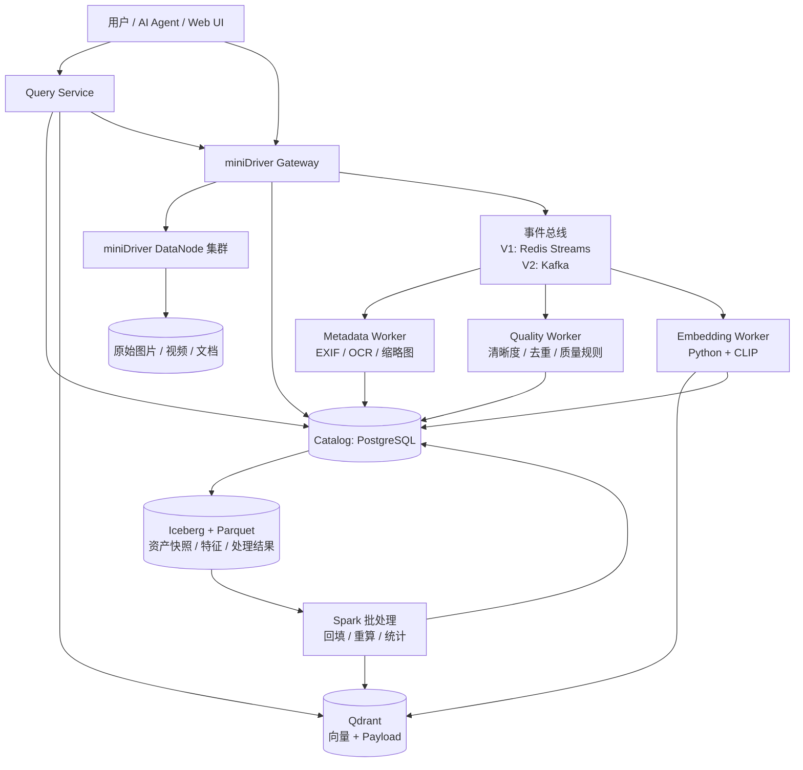
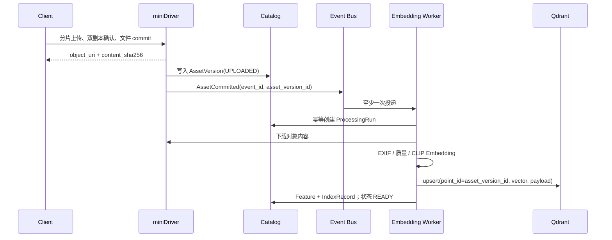
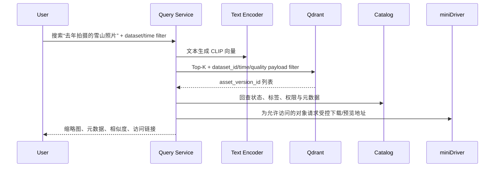

# CineLake：多模态 AI 数据湖与智能检索平台

> 状态：设计与学习文档；尚未实现。  
> 定位：以 miniDriver 为原始对象存储层的第二核心项目，而不是另一个 RAG 聊天 Demo。

## 1. 为什么要做 CineLake

大模型或 RAG 应用的效果，常常不是先受限于模型，而是受限于数据是否能够被可靠保存、发现、处理、
版本化、检索和复现。对于摄影图片、视频、音频和文档等非结构化数据，仅有“上传/下载文件”还不够：

- 不知道一个文件属于哪个数据集、由谁何时上传、处理到了哪一步；
- 无法按时间、设备、质量、标签等条件发现数据；
- 模型升级后，不能可靠地重算 Embedding，也无法复现某次训练/检索所使用的数据版本；
- 处理失败、重复投递或 Worker 重启时，可能产生重复向量或漏处理；
- RAG 只能临时把文件塞进向量库，无法形成数据资产管理闭环。

CineLake 的目标是把这些能力做成一条可追踪的数据链路：

```text
可靠对象写入 → 数据资产登记 → 事件驱动处理 → 特征/向量索引
      → 结构化查询与语义检索 → 数据版本、质量与血缘可追溯
```

它的差异化不在于“接一个 LLM”，而在于同时展示：C++ 存储数据面、异步处理流水线、数据目录、
向量检索与湖仓版本管理。

## 2. 项目边界与总体原则

### 2.1 与 miniDriver 的关系

miniDriver 保持独立，职责仍是可靠、高性能的对象存储：Chunk 上传、双副本、完整性校验、断点续传、
资源治理和对象下载。CineLake 通过 `StorageAdapter` 调用它，不修改其已验证的数据面协议。

```text
miniDriver = 原始对象（raw bytes）的可靠存储系统
CineLake   = 建立在对象之上的数据资产、处理、索引与查询平台
```

建议把 CineLake 建成独立仓库；本地开发时将 miniDriver 作为依赖服务启动，而非把所有组件合并到
一个 C++ 进程中。

### 2.2 不做什么

第一版明确不做：

- 不自研消息队列、向量数据库、表格式或分布式计算引擎；
- 不同时引入 Kafka、Flink、Spark 三套处理体系；
- 不把原始图片/视频写入 Iceberg；
- 不做多租户计费、Raft 元数据高可用、Kubernetes 生产调度；
- 不以“聊天页面”作为项目主体。

这避免项目变成技术栈拼盘，并确保每一个组件都解决一个具体问题。

## 3. 目标架构



### 3.1 分层职责

| 层 | 建议组件 | 负责什么 | 不负责什么 |
|---|---|---|---|
| 原始对象层 | miniDriver | 文件字节、分片、副本、hash、下载 | Dataset 版本、Embedding、SQL 分析 |
| Catalog | PostgreSQL | Dataset、Asset、版本、状态、任务、血缘 | 存大文件、近邻向量搜索 |
| 事件层 | Redis Streams → Kafka | 解耦上传与处理、重试、重放、扩展消费者 | 直接执行 AI 推理 |
| 处理层 | Python Worker | 提取元数据、质量、缩略图、Embedding | 保存原始对象 |
| 向量层 | Qdrant | Top-K 近邻召回、Payload 条件过滤 | 文件访问控制的唯一来源 |
| 湖仓层 | Iceberg + Parquet + Spark | 批量分析、快照、Schema 演进、回填 | 在线逐文件低延迟处理 |
| 查询层 | FastAPI（V1） | 聚合检索结果、访问校验、接口 | 直接承担模型训练 |

## 4. 关键数据模型

Catalog 是 CineLake 的事实来源；向量库和 Iceberg 表均可由它追溯。

```text
Dataset
  dataset_id, name, description, owner, status, created_at

DatasetVersion
  dataset_version_id, dataset_id, manifest_uri, snapshot_at, status

Asset
  asset_id, dataset_id, logical_name, media_type, created_at

AssetVersion
  asset_version_id, asset_id, object_uri, content_sha256, size_bytes,
  ingest_at, state(UPLOADED/PROCESSING/READY/FAILED)

ProcessingRun
  run_id, asset_version_id, stage, processor_version, input_hash,
  state, attempt, started_at, finished_at, error

Feature
  feature_id, asset_version_id, feature_type, model_version,
  payload_uri/value, created_at

EmbeddingIndexRecord
  asset_version_id, model_version, vector_collection, vector_point_id, state
```

关键原则：`Asset` 表示逻辑资产，`AssetVersion` 表示不可变内容版本。一个新上传覆盖同名文件时，
创建新版本而非修改旧记录；模型也必须有版本号。这使“用哪个对象版本、哪个 CLIP 模型生成了哪个
向量”可以完整回答。

## 5. 核心时序与一致性策略

### 5.1 上传到可检索



### 5.2 为什么采用“至少一次 + 幂等”，而不是承诺 exactly-once

消息可能在 Worker 已写向量、但尚未确认消费时重复投递。端到端 exactly-once 成本很高，也不需要
成为第一版目标。实际策略是：

1. 每个事件带 `event_id`、`schema_version` 和 `asset_version_id`；
2. `ProcessingRun` 以 `(asset_version_id, stage, processor_version)` 建唯一约束；
3. Qdrant 使用确定的 `point_id=asset_version_id + model_version` 做 upsert；
4. 只有 Catalog 与向量记录都成功后，才将资产置为 `READY`；
5. Worker 崩溃后可认领未完成消息，按同一幂等键安全重试。

这会得到“至少一次处理、效果等价于一次写入”的工程语义。

### 5.3 语义检索



向量库只负责召回；最终展示前必须回查 Catalog，以过滤已删除、未完成或无权限的资产。

## 6. Iceberg 与 Spark 在本项目中的正确位置

Iceberg 不是新的对象存储，也不是在线检索数据库。它存的是面向分析的结构化表，例如：

```text
asset_snapshot_table
  asset_version_id | dataset_version_id | object_uri | media_type | camera |
  taken_at | quality_score | embedding_model | embedding_point_id | ingest_date
```

它带来三种关键价值：

- **数据快照**：训练任务指定某个 DatasetVersion，后续新增/删除资产不改变已使用训练集；
- **Schema 演进**：以后新增 `ocr_text`、`license` 或 `quality_score` 时，历史表不必整体重建；
- **批量重算**：更换 CLIP 模型后，Spark 读取指定快照，批量重新生产 Embedding 或质量统计。

Iceberg 的快照和 Schema 演进来自其表格式设计；Spark Structured Streaming 则使用与批处理一致的
DataFrame/Dataset 模型处理持续数据。参见 [Apache Iceberg 规范](https://iceberg.apache.org/spec/) 和
[Spark Structured Streaming 文档](https://spark.apache.org/streaming/)。

因此：V1 每个对象由 Worker 在线处理；V2 才使用 Spark 做离线回填、数据集统计和模型升级重算。

## 7. 分期计划与可验收成果

### Phase 0：基础可运行环境（约 1 周）

- 为 miniDriver 补 Dockerfile/Compose 开发部署；
- Compose 运行 Gateway、两个 DataNode、Redis、PostgreSQL、Qdrant；
- 建立 `StorageAdapter`，完成上传、对象读取和预览 URL 的最小调用；
- 建立统一配置、健康检查与本地示例数据集。

验收：`docker compose up` 后可上传一张 JPEG，数据实际保存在 miniDriver；不在本阶段做性能结论。

### Phase 1：数据资产与事件处理闭环（约 2 周）

- PostgreSQL 实现 Dataset / Asset / AssetVersion / ProcessingRun；
- 复用 miniDriver 已有 Redis Stream 媒体任务能力，扩展 `AssetCommitted` 事件；
- 实现 Python Metadata Worker：EXIF、MIME、尺寸、缩略图、失败重试；
- Dataset 浏览 API：按 Dataset、时间、相机、状态筛选。

验收：上传、重复投递、Worker 重启后，Catalog 中只有一条正确的资产版本和处理结果；可查看处理
状态与失败原因。

### Phase 2：Embedding 与多模态检索（约 2 周）

- 使用 CLIP 图文模型生成统一向量；
- 使用 Qdrant 保存向量及 `dataset_id/time/camera/quality` Payload；
- 实现文本搜图、相似图搜索、条件过滤和结果回查；
- 加入模型版本与索引状态，避免旧模型与新模型的向量混用。

验收：上传图片到检索可用的端到端延迟可观测；文本检索、结构化筛选和已删除资产过滤均正确。
Qdrant 的 Payload filter 可用于组合向量召回和元数据过滤，见
[Qdrant Filtering 文档](https://qdrant.tech/documentation/concepts/filtering/)。

### Phase 3：湖仓版本与批量回填（约 3--4 周）

- 将资产清单、处理结果写为 Parquet/Iceberg 表；
- 生成 Dataset Manifest 和可查询 Snapshot；
- Spark Job 按指定 DatasetVersion 重算质量、统计或 Embedding；
- 记录 `raw asset → processing run → feature → vector index` 血缘。

验收：指定某个 DatasetVersion 能稳定得到相同资产清单；更换模型后可新建处理版本并批量回填，旧版本
仍可查询。

### Phase 4：可选增强，而非前置条件

- Kafka 替换/扩展 Redis Streams，验证多消费者、分区与重放；
- RAG：将 CineLake 检索结果提供给 LLM，并携带资产来源；
- 数据质量策略、重复样本聚类、生命周期管理；
- K8s、GPU Worker 调度、多节点部署与容量报告。

Kafka 应在需要多个独立消费者、较长保留期或可控重放时引入，而不是为了关键词而替换已经可用的
Redis Streams。其发布/持久存储/消费模型可参见 [Kafka 官方文档](https://kafka.apache.org/documentation/)。

## 8. 从头到尾需要补的知识地图

### 已有基础：可直接迁移

| 已有 miniDriver 能力 | 在 CineLake 中的价值 |
|---|---|
| Gateway/DataNode、分片、双副本、SHA-256 | 原始多媒体数据可靠落盘与可校验对象标识 |
| Redis Streams、缩略图/RAW Worker | 异步任务、消费者、失败重试的起点 |
| LevelDB 元数据、HTTP API、Web UI | 理解对象元数据与资产浏览 API |
| 压测、背压、结构化日志 | 为新平台建立 ingest latency、worker lag、查询尾延迟指标 |
| Node Agent/YAML 配置 | 后续多服务本地部署和运行管理基础 |

### 第一优先级：先学才能做 V1

1. **Docker 与 Docker Compose**：镜像、网络、Volume、健康检查、环境变量、服务依赖；
2. **PostgreSQL 数据建模**：主键/外键、唯一约束、事务、索引、迁移、分页查询；
3. **事件驱动与幂等**：至少一次投递、consumer group、ack/claim、死信、重试、outbox 思想；
4. **Python 服务工程化**：虚拟环境、FastAPI、Pydantic、SQLAlchemy/Alembic、日志与 pytest；
5. **媒体基础**：EXIF、MIME、缩略图、视频元数据、对象版本与内容 hash 的区别。

### 第二优先级：实现 AI 检索闭环

1. **Embedding 基础**：向量维度、余弦相似度、归一化、模型版本、批处理和 GPU/CPU 推理差异；
2. **CLIP**：图像和文本投影到同一向量空间；理解其局限，不把演示检索结果当作绝对正确性；
3. **Qdrant**：collection、point、upsert、HNSW 近似检索、Payload filter、索引构建和删除一致性；
4. **检索评测**：准备有标注的小数据集，计算 Recall@K、人工检查错误样例、记录 query P50/P95。

### 第三优先级：形成湖仓/Data Infra 能力

1. **Parquet**：列式存储、分区、谓词下推、文件大小；
2. **Iceberg**：Catalog、snapshot、manifest、Schema evolution、partition evolution、time travel；
3. **Spark SQL/DataFrame**：读取 Parquet/Iceberg、join、聚合、shuffle、数据倾斜、batch job；
4. **数据治理**：Dataset manifest、质量规则、资产状态机、血缘、生命周期、可复现性；
5. **容量与可观测性**：吞吐、event lag、处理成功率、失败率、重试、query P95、存储增长与成本。

### 最后再学：按需求引入

- **Kafka**：topic、partition、consumer group、offset、rebalance、retention；
- **Flink**：真正需要低延迟连续窗口、状态计算或流式 join 时再引入；
- **Kubernetes**：Pod、Deployment、StatefulSet、Service、PVC、GPU 调度；
- **RAG/Agent**：检索增强生成、rerank、引用归因、权限过滤；它是 CineLake 的消费者，不是数据底座。

## 9. 推荐代码仓库结构

```text
CineLake/
  compose.yaml
  docs/
  event-schemas/          # JSON Schema / 事件版本说明
  catalog-service/        # Dataset、Asset、Version、处理状态 API
  query-service/          # 结构化查询 + 向量检索聚合 API
  workers/
    metadata-worker/
    embedding-worker/
    quality-worker/
  lakehouse/
    spark-jobs/
    iceberg-ddl/
  storage-adapter/        # 调用 miniDriver 的客户端/HTTP 适配层
  tests/
    integration/
    e2e/
```

miniDriver 作为独立服务通过 Compose 引用。这样面试时能够清楚说明：底层存储和上层数据基础设施分别
解决什么问题，且二者可以独立演进。

## 10. 需要测试和展示的指标

不要只展示“搜到猫图”。至少记录：

| 指标类别 | V1 应记录的指标 |
|---|---|
| 摄取 | 上传 commit 到事件投递延迟、事件积压、重复事件数 |
| 处理 | 上传到 READY 的 P50/P95、每阶段耗时、成功率、重试/死信数 |
| 检索 | 文本检索 P50/P95、Recall@K、小数据集人工评测结果 |
| 一致性 | 重放后重复 Feature/Vector 数、删除资产残留数、Catalog/向量状态差异 |
| 资源 | Worker CPU/RSS、每图推理耗时、向量索引大小、对象存储增长 |
| 可复现 | 指定 DatasetVersion 的资产数量与 Manifest hash 是否一致 |

## 11. 难度评估与最终建议

| 范围 | 难度 | 价值 | 建议 |
|---|---:|---:|---|
| Phase 0--2：资产、事件、CLIP、Qdrant 检索闭环 | 7/10 | 很高 | 必须完成，作为第二项目主体 |
| Phase 3：Iceberg + Spark + 版本/血缘 | 8.5/10 | 极高 | 选一个完整回填案例完成即可 |
| Kafka + Flink + Spark + K8s + Raft 全部实现 | 10/10 | 风险极高 | 不作为单个项目的交付目标 |

最合适的终点不是“模拟一个大厂全部平台”，而是完成下列可演示、可解释的证据链：

```text
miniDriver 可靠保存原始对象
  → CineLake 将其登记为可版本化 Dataset 资产
  → 事件可重放地驱动特征与 Embedding 生产
  → Qdrant 支持语义 + 条件检索
  → Iceberg/Spark 能按历史数据版本离线回填
  → 指标证明处理延迟、失败恢复和检索质量
```

这条链路足以把项目从“对象存储”升级为“面向多模态训练数据的数据基础设施”，并且每个技术选择都
有明确业务原因。
