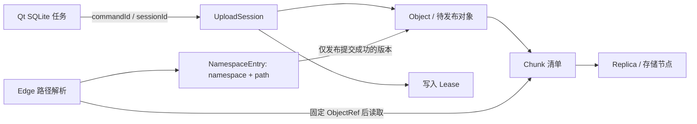

# MiniDriver 元数据、断点续传与虚拟目录修复计划

日期：2026-10-04  
审查基线：`v4`，代码提交 `64abf5d`，以及当前工作区的部署文件。  
文档状态：设计与实施计划；不代表修复已完成或生产验收已通过。  
范围：Raft Metadata、Gateway、C++ SDK、Edge、Qt SQLite 任务恢复、升级与历史数据检查。

## 1. 结论与实施目标

现有系统已有 Object、UploadSession、Chunk、Replica、Lease、Node、Catalog、Dedup、Snapshot 等基础结构；应在这些结构上补齐状态规则，不需要重写全部存储系统。

本次问题的直接表现是：同名文件第一次上传失败，重新上传后，Qt 在线点播仍收到 HTTP 404，Edge 返回 `virtual path is not available`。代码审查发现 Gateway 普通目录暴露了未提交对象，Edge 又在遇到第一个不可用同名对象时直接退出。它们共同允许失败上传遮挡成功上传。

审查还发现更高优先级的状态机问题：删除旧同名对象会误删另一个对象的路径绑定，删除中的对象能被迟到提交重新发布，重试命令的动态过期时间破坏幂等。单独补 SQLite 或调整 Edge 查找顺序，不能解决这些问题。

本计划的完成标准是：

1. 一个租户的一个规范化虚拟路径只有一个当前已发布绑定。
2. 失败、取消、过期的上传尝试不遮挡、不删除、不复活已发布对象。
3. 已提交的相同逻辑请求在超时、重启、换 Gateway 后仍可准确识别。
4. 续传以服务端已提交 Chunk 集合为准，客户端 SQLite 只保存本地任务上下文。
5. 上传成功意味着文件提交已被权威元数据确认，而不是进度条到达 100%。
6. 删除和回收不与迟到写入、提交、读取产生相互矛盾的结果。
7. 新旧协议与快照有明确兼容策略，历史数据修复可预览、可审计。

首轮不实现透明内容去重、自动覆盖、多历史版本管理和多 Gateway 客户端负载均衡。现阶段采用“路径已存在返回冲突；继续原任务复用身份”的明确策略，后续再增加显式版本替换。

## 2. 证据等级与当前已知边界

| 标记 | 含义 |
| --- | --- |
| R：隔离复现 | 对当前源码运行内存状态机诊断，得到具体结果；未触碰实际集群 |
| S：源码确认 | 代码路径已确认，但尚未执行完整的跨服务或故障注入测试 |
| O：现场观察 | 用户提供的 HTTP、Qt 或 K3s 输出 |
| V：待验证 | 审查发现需要验证的风险，不能写成已发生的线上事故 |

已运行的临时诊断输出：

```text
same_command_new_expiry=COMMAND_ID_REUSE_MISMATCH
commit_after_delete=OK readable=1 pending_deletes=1
same_path_after_deleting_old_attempt=OK,OK committed_count=2
```

这三个结果分别证明：动态 expiresAt 会改变命令身份；删除后迟到提交可恢复可读性；误删路径绑定后可以提交第二个同路径对象。它们不证明线上数据已经发生同样损坏。

点播现场输出：

```text
GET /vod/_DSC5352.MOV
Range: bytes=0-15 或 bytes=-1048576

HTTP/1.1 404 Not Found
{"error":"virtual path is not available"}
```

这证明 Edge 命中了一个不可用同名条目；是否同时存在一个已成功提交的同名条目，还需要现场目录/对象清单确认。不能仅凭 404 判定所有数据丢失。

## 3. 元数据到底负责什么

### 3.1 权威数据与非权威状态

| 数据 | 权威位置 | 作用 | 不应承担的作用 |
| --- | --- | --- | --- |
| NamespaceEntry / Catalog | Raft 状态机 | 路径映射到当前对象版本 | 不承载全部失败上传任务 |
| Object / ObjectVersion | Raft 状态机 | 大小、分块方案、内容声明、发布状态 | 不用本地路径识别内容 |
| UploadSession | Raft 状态机 | 上传身份、所属对象、生命周期、恢复进度 | 不把客户端进度百分比当完成证据 |
| Chunk / Replica | Raft 状态机 | 存储身份、校验值、节点、副本提交状态 | 不保存文件实体字节 |
| Lease | Raft 状态机 | 有期限的写入资格、代次、容量预留 | 不与会话保留期限混为一谈 |
| Node 注册与 epoch | Raft 状态机 | 节点身份、地址、重启代次 | 不替代实时心跳 |
| 心跳、队列、瞬时负载 | Leader soft state | 放置决策的短期输入 | 不因 Leader 切换就丢失已提交对象 |
| Dedup / 命令结果 | Raft 状态机 | 重复请求去重、返回已知结果 | 不永久无限保存所有临时错误 |
| DeleteTask / GC | 持久元数据与执行器 | 异步副本清理、确认与重试 | 不直接由 UI 清理块文件 |
| Qt SQLite | 客户端本地 | 文件位置、任务身份、目标集群、用户意图 | 不作为服务端 completed[] 的权威 |
| Edge 缓存 | Edge 本地 | 加速已发布对象的字节读取 | 不决定目录归属或上传是否成功 |

### 3.2 身份必须分开

| 字段 | 语义 | 稳定性要求 |
| --- | --- | --- |
| localPath | 本机文件位置 | 允许重新定位；不参与服务端路径身份 |
| namespace + virtualPath | 用户目标位置 | 统一规范化，提交时唯一 |
| taskId | Qt 本地任务 | 应跨应用重启保留 |
| commandId | 一次逻辑操作的幂等身份 | 重试相同操作不能重新生成 |
| sessionId | 上传会话 | 服务端确认后持久化，查询实时状态 |
| objectId + objectVersion | 一份不可变的已提交数据 | 点播、下载、缓存使用此身份 |
| requestFingerprint | 逻辑请求参数的规范摘要 | 同操作重试不受时间、节点负载影响 |
| contentFingerprint | 内容等同性声明 | 不含 commandId、文件名、机器路径 |
| chunk checksum | 分块完整性校验 | 明确算法，不能把 CRC32C 当安全内容身份 |
| metadataVersion | 元数据变更顺序 | 不等于对象业务版本，也不等于上传次数 |

### 3.3 建议的数据关系



允许上传时先创建内部 ObjectRecord；正确性要求是它还没有普通目录绑定。无需为了隐藏半成品而禁止创建内部对象。

## 4. 原有问题清单与代码依据

以下位置以审查基线为准。实施后行号可能变化，应优先按函数名定位。

### M01：目录枚举绕过权威路径映射，失败对象遮挡成功对象

- 等级：O + S；优先级 P0。
- `src/metadata/MetadataStateMachine.cpp`：`objects()` 返回同目录中除 `Deleting` 外的所有对象，包括 `Uploading/Failed`。
- `src/gateway/GategayState.cpp`：`listCatalog()` 使用上述列表；所有非 `Committed` 状态被映射为 `PROTECTING`。
- `src/edge/edge_cache_main.cpp`：`resolveVirtualObject()` 扫描同名项，遇到非 `AVAILABLE` 立即退出。
- 同名排序没有规定以提交绑定为准，列表顺序不应决定路径语义。

影响：第一次失败残留可能挡住第二次成功对象；UI 无法区分上传中与失败；在线点播 404。

修复方向：普通目录和 ResolvePath 都读取 `catalog_`；上传尝试放入独立管理/恢复接口。仅修改 Edge 为“寻找第一个 AVAILABLE”只能作为兼容兜底，不能替代权威路径解析。

### M02：删除对象时无条件删除路径绑定

- 等级：R；优先级 P0。
- `MetadataStateMachine::applyNew(kDeleteObject)` 无条件执行 `catalog_.erase(pathKey)`。
- 没有判断当前绑定的对象是否就是被删除的对象。

复现：A 上传未完成，B 同名提交成功；删除 A；B 的绑定被误删；C 同名提交也成功，出现两个同路径 `Committed` 对象。

修复方向：按对象身份比较后删除绑定；所有删除路径，包括批量删除、历史修复，都使用同一规则。被删除对象没有占用当前路径时，只清理它自己的生命周期记录。

### M03：删除和终态缺少写入/提交隔离

- 等级：R + S；优先级 P0。
- `kCommitFile` 检查块完成数和路径冲突，但未完整约束对象必须仍处于可提交状态。
- `kReserveLease/kCommitChunk` 也需要统一核对 Session 与 Object 状态，不能只检查块/Lease。
- `kDeleteObject/kDeleteDirectory` 与 Session 作废、活跃 Lease 作废之间缺少完整联动。

复现：所有 Chunk 已提交，Object 尚未提交；删除 Object；提交文件；得到 `OK`、对象可读且删除任务仍存在。

修复方向：统一生命周期前置条件；删除先使新写入/新提交失效，再异步回收。已完成逻辑操作的重放可以返回历史结果，但不得再次修改或复活数据；API 同时告知当前资源状态。

### M04：动态过期时间破坏 commandId 幂等

- 等级：R + S；优先级 P0。
- `GatewayState::preflightUpload()` 每次生成 `expiresAt = now + 300`。
- `MetadataCommand.cpp` 的命令编码包含 `expiresAt`；规范化仅清除了 `issuedAt`。
- 相同 commandId 隔一秒重试即可得到不同指纹。
- 预留放置也可能随节点 epoch、负载变化而改变；重复创建不能重新选一组目标后继续使用旧操作身份。

修复方向：稳定逻辑请求与服务端生成结果分开；在 Metadata 权威状态中保存原始创建结果。重复创建先核对稳定请求身份、返回原 Session，后续查询/续租走独立操作。

禁止简单删除所有校验字段。checksum、目标路径、大小、分块配置、写入策略仍必须参与请求指纹。

### M05：Raft 预检响应没有准确恢复 completed[]

- 等级：S；优先级 P0。
- `GatewayState::preflightUpload()` 的 remote 分支清空输出后，仅拷贝部分 Session 字段，未填充实际完成块集合。
- 同分支把 `request.chunks` 全量作为 `missingChunks`。
- `uploadPreflightJson()` 从 `result.session.completed` 输出数组。
- SDK 发现预检响应包含 Session 基本字段，就直接使用响应计算 pending，跳过额外 GET。

影响：即使找到了原 Session，也可能把完成块当成未上传；已提交块重传、重复申请 Lease 会触发冲突。

修复方向：提供一个一致的 UploadStatus 描述，明确输出完成索引或范围、状态、Session 身份及 metadataVersion；创建与查询复用此描述，不人工拼不完整的响应。

### M06：Session 生命周期过短，缺少续租与明确终态

- 等级：S；优先级 P1，但应在发布跨重启续传前完成。
- Session 和初次 Chunk Lease 共用约 300 秒期限。
- Session 只有 `expired` 布尔字段，不足以表达完成、用户取消、过期、恢复中等差异。
- 当前命令集合没有完整的续租/用户取消会话协议。

影响：大文件、慢节点、短暂断网可超过期限；长时间离线后的恢复没有清晰规则。

修复方向：Session 保留时间、活跃写 Lease 时间、客户端网络超时分别配置；新增显式状态与续租命令。延长 300 秒只能缓解，不能替代规则修复。

### M07：manifestHash/contentHash 的命名与实际含义不一致

- 等级：S；优先级 P1。
- SDK `uploadFile()` 的 canonical 文本包含 commandId 派生 routeKey、块序号、块大小，不包含块内容摘要。
- 得到的 SHA-256 被作为 manifestHash，又进入 Object 的 contentHash 字段。
- 默认 CRC32C 路径未必计算各块 SHA-256；不能声称上传前已经获得了整文件 SHA-256。

影响：不能拿现有字段做内容发现或可靠去重。相同内容换任务得到不同值；相同任务身份和大小下，manifestHash 本身又不足以证明内容相同。

修复方向：保留旧字段兼容含义，引入明确带算法版本的内容身份。服务端命令指纹仍需包含实际块摘要，不能用现有 manifestHash 替代。

### M08：会话过期与物理块回收没有完整衔接

- 等级：S；优先级 P1。
- `kExpireSession` 标记 expired、释放活跃 Lease、把上传对象改为 Failed。
- 该路径没有为已经提交的部分块生成完整清理任务。
- `kDeleteObject` 仅为有 Replica 信息的块生成 DeleteTask；没有副本的残留记录、未 ACK 的物理写入，需要单独覆盖。
- DataNode 可能已落盘而提交确认丢失，元数据不能仅靠 completed 数推断物理磁盘没有该块。

修复方向：取消/过期后的回收使用持久任务、宽限期、节点清单核对与重试；完成清理后再裁剪元数据。禁止直接扫描目录后按文件年龄删除仍可能有效的数据。

### M09：目录读取把元数据错误降级为空列表

- 等级：S；优先级 P1。
- `MetadataClient::objects()/directories()` 在请求失败时返回空 vector，错误通过可选参数输出。
- Gateway `listCatalog()` 未传递并检查这些错误，根目录可能仍返回成功和空列表。

影响：丢 quorum、Leader 暂不可达会被误表现为“目录空了”或“文件不存在”，影响 UI 与 Edge 判断。

修复方向：读取接口返回有状态的结果，区分 `OK_EMPTY/NOT_FOUND/UNAVAILABLE/FORBIDDEN`；元数据不可用映射 503，不映射 404。

### M10：部分内部读接口位于认证检查之前

- 等级：S；优先级 P1，跨主机开放部署前必须处理。
- `metadata_service_main.cpp::handle()` 中 catalog、sessions、delete-tasks、nodes 等分支先于 `authorized()` 返回。
- Gateway remote 路径固定 owner 为 admin；尚不是多用户 ACL 实现。

修复方向：明确公开健康接口白名单，其余业务内部接口先认证；所有调用方补齐内部凭据。为当前可信集群保留兼容部署步骤，不能宣称已经支持用户隔离。

### M11：目录层级和路径规范化需要集中到权威边界

- 等级：S/V；优先级 P1。
- 创建 Session 的状态机检查没有完整验证父目录存在、名称与目录冲突、规范化路径。
- 内部查询 URL 的 owner/path 存在直接拼接实现，需要验证含 `+ & # % ?` 与中文的路径行为。

修复方向：Gateway 与 Metadata 使用统一路径规则；Metadata 最终验证，不能依赖所有调用方永远正确。确定 UTF-8、大小写、重复斜线、点路径规则，转义只解码一次。

### M12：去重与全量扫描需要有界维护

- 等级：S；优先级 P2。
- dedup_ 不断增长；失败结果也被记录。
- Session 清理扫描全量列表，目录从对象集合过滤，Snapshot 包含这些累积状态。

修复方向：目录索引分页、按截止时间的 Session 索引、幂等记录保留策略、回收指标。不能直接按固定天数删除 dedup，否则迟到重试可能重复创建。

### M13：Raft 批处理、强一致读需专项验证

- 等级：V；优先级 P1 验证门禁。
- `proposeBatch()` 将多条独立命令交给 Raft；“一次 append/fsync”不代表业务全有或全无。
- `createSessionAndReserve()` 可能出现创建成功、部分预留失败的中间结果；响应必须能表达并恢复。
- `linearizableReadBarrier()` 使用 Leader 存活判断和 applied-index 等待；需要核对实际 NuRaft 版本语义，并测试分区、换届窗口，不能只凭函数名宣称已证明线性一致。

本计划不把上述风险写成已证实的 Raft 协议错误。应以故障测试和依赖实现审查补证据。

## 5. 必须固定的不变量

| 编号 | 不变量 | 主要保护位置 |
| --- | --- | --- |
| I01 | 一个 namespace + 规范化路径只有一个当前绑定 | Metadata Commit/Resolve/List |
| I02 | 可见目录项只指向已提交、允许读取的对象 | Catalog + ResolvePath |
| I03 | 未完成任务不能移除别人的目录绑定 | DeleteObject/DeleteDirectory |
| I04 | 删除、取消、过期对象不能被新写入或新提交复活 | Reserve/Commit/Abort/Expire |
| I05 | 同一稳定请求身份只产生一个逻辑 Session 结果 | Create/Exact Resume |
| I06 | 同 commandId 不同语义参数必须冲突 | 请求指纹校验 |
| I07 | Chunk 完成只由服务端副本提交决定 | CommitChunk/UploadStatus |
| I08 | 上传发布需要全体预期 Chunk 达到所需 RF | CommitFile |
| I09 | 冲突、不可用、鉴权失败不能伪装成不存在 | MetadataClient/Gateway/Edge |
| I10 | 删除任务不得删除被当前有效对象引用的数据 | GC + Replica fencing |
| I11 | 相同对象版本的缓存字节不可因同名替换而混用 | Edge cache key / ReadPlan |
| I12 | 所有修改路径在日志回放和快照恢复后结果一致 | 状态机/Snapshot/迁移 |

Raft 负责复制确定性的状态转换；这些不变量仍需业务状态机实现。三个副本一致地执行错误规则，仍然会得到三个一致的错误结果。

## 6. 阶段依赖与发布边界

```text
阶段 0：建立证据、回归夹具和只读审计
    ↓
阶段 1：状态机终态与删除隔离（P0）
    ↓
阶段 2：权威目录 / ResolvePath / 点播 404 修复（P0）
    ↓
阶段 3：服务端精确恢复、会话生命周期与 SDK（P0/P1）
    ↓
阶段 4：Qt SQLite 持久化与跨重启恢复（P1）
    ↓
阶段 5：稳定内容指纹与恢复候选发现（P1/P2）
    ↓
阶段 6：GC、鉴权、错误传播、扩展性完善（P1/P2）
    ↓
阶段 7：快照兼容、历史审计、三机与 Windows 发布验收
```

阶段 6 中错误传播和内部鉴权应随前面涉及接口的阶段尽早修复，不能为了阶段编号延迟明显的问题。阶段 7 的兼容设计从阶段 0 开始，每次变更均须执行相应发布门禁。

可交付里程碑：

- R1：阶段 1 + 2，修复目录和状态正确性；现有成功文件应可正常点播。
- R2：阶段 3 + 4，支持跨 Qt 重启的精确续传。
- R3：阶段 5 + 6，增加本地记录丢失后的恢复发现、回收和运维能力。

## 7. 阶段 0：建立基线、诊断与回归夹具

### 7.1 要做的事

1. 记录三台 Metadata、Gateway、Edge、Windows 客户端的代码 revision、镜像 ID、协议能力；同名 tag 不能作为同版本证据。
2. 保存只读元数据检查报告：路径绑定、对象状态、同名对象、Session、Chunk 完成数、删除任务。
3. 把临时内存复现转成正式回归测试，用明确的不变量作为断言。
4. 给后续集成测试建立独立目录/命名空间和独立 hostPath；只建新 Kubernetes namespace 仍不足以隔离相同 hostPath。
5. 记录现有测试通过情况；说明单机状态机测试不能代表三机故障测试。

建议新增测试文件（当前不存在，实施时创建）：

| 文件 | 测试重点 |
| --- | --- |
| `test/test_metadata_namespace_lifecycle.cpp` | 目录绑定与删除/提交竞争 |
| `test/test_metadata_upload_resume.cpp` | 幂等、过期、恢复完成集合 |
| `test/test_edge_virtual_path_resolution.cpp` | 同名失败残留、权威路径读取 |
| `test/test_metadata_repair_migration.cpp` | 旧快照、异常目录审计与修复 |

### 7.2 必须先变红的回归测试

| ID | 步骤 | 修复后的预期 |
| --- | --- | --- |
| S01 | A 未提交，B 同名提交，删除 A | B 的绑定与读取不变 |
| S02 | 块已完成，文件未发布，删除后迟到 CommitFile | 拒绝发布；无可读对象 |
| S03 | 删除后迟到 ReserveLease/CommitChunk | 拒绝写入；不增加完成数 |
| S04 | 相同逻辑创建请求隔秒重试 | 返回原 Session，不因动态时间冲突 |
| S05 | 原会话完成 N 块后查询恢复 | completed 精确为 N，pending 精确为剩余块 |
| S06 | 两个并发同路径上传都完成数据传输 | 最多一个发布成功，另一个明确冲突 |
| S07 | 断开 Metadata quorum 后列根目录 | 503/不可用，不是 200 空数组 |

### 7.3 验收与风险

- 复现必须独立于 UUID 排序、墙钟偶然性和测试执行顺序。
- 临时诊断“执行成功”表示它成功展示了漏洞，不表示系统正确。
- 不删除真实 `_DSC5352.MOV` 或其失败记录来让测试变绿。
- 阶段产出：基线报告、可重复测试、当前部署 revision 清单。

## 8. 阶段 1：修复状态机终态与删除隔离

### 8.1 核心改动

主要文件：`MetadataStateMachine.cpp`、`MetadataTypes.hpp`、相关状态机测试。

1. 提取比较解绑方法：仅当 `catalog_[key] == deletingObjectId` 时删除该路径绑定。若版本模型扩展，再同时匹配绑定版本。
2. CommitFile 对新提交要求对象仍为 Uploading、Session 仍允许提交、引用关系一致、Chunk 清单完整且全体已提交。
3. 删除对象/目录时，在同一确定性状态转换中使关联上传不可继续，并终止活跃 Lease、释放预留容量。
4. ReserveLease/CommitChunk 不允许为终态任务创建新的事实；不允许通过更换 commandId 绕过终态检查。
5. 重放已成功命令可以返回原结果，但没有新的状态变化；对外查询另行返回资源当前状态。
6. 检查 DeleteDirectory 的同名对象、子目录、迟到上传行为；路径比较应按组件/明确前缀执行。
7. CommitFile 校验 manifest/内容声明与创建时绑定的请求一致，不允许最终提交任意改写内容声明。

### 8.2 状态转换约定

Object 建议保留简单状态：

```text
Uploading → Committed
Uploading → Failed
Uploading / Failed / Committed → Deleting
Deleting → 物理清理完成后移除或保留墓碑
```

禁止 `Deleting → Committed` 和 `Failed → Committed` 的普通提交。若未来需要恢复失败对象，必须设计独立、带前置条件的恢复命令，不能靠重放 CommitFile 隐式实现。

会话新增枚举的协议迁移放在阶段 3；本阶段先在现有字段兼容范围内封住危险路径。历史日志重放语义必须遵守第 16 节，不可直接改变旧日志的结果后随意滚动发布。

### 8.3 测试矩阵

| ID | 场景 | 断言 |
| --- | --- | --- |
| L01 | 删除失败 A，成功 B 同路径 | 仅 A 进入删除；B 可 Resolve/Read |
| L02 | 删除前后重复发送 CommitFile，新旧 commandId 各一次 | 不复活对象；重放无副作用 |
| L03 | 删除后申请 Lease | 拒绝；reservedBytes/reservedWrites 不增长 |
| L04 | 删除与 CommitChunk 两种日志顺序 | 结果符合顺序；删除后不新增可读副本 |
| L05 | DeleteDirectory 与上传最终提交两种顺序 | 不出现目录已删却被迟到请求静默发布 |
| L06 | 重复 Delete/Release/Expire | 预留容量不负数、不重复扣减 |
| L07 | 完成数看似正确但清单缺块/状态异常 | 拒绝 CommitFile |
| L08 | 导出快照再恢复后执行上述场景 | 语义一致，stateDigest 一致 |

### 8.4 阶段验收

所有 L 用例通过；不再出现“readable=1 且该对象正在被删除任务清理”的矛盾。已有成功上传/下载测试继续通过。

## 9. 阶段 2：统一普通目录、路径解析和 Edge 点播

### 9.1 服务端目录职责

1. 增加 `listPublishedEntries(namespace, parentPath)` 和 `resolvePublishedPath(namespace, path)`。
2. 从 `catalog_` 取得绑定，再核对 Object 状态；不从全部 ObjectRecord 列表推断路径归属。
3. 保留单独的 UploadSession/对象管理视图，用于恢复和审计，不混入普通 catalog。
4. 查不到绑定返回 NotFound；绑定存在但对象缺失或状态违反不变量，返回元数据一致性错误并记录审计事件，不能随机选择另一个对象。
5. 多次列表/对象读取最好形成同一受保护快照；目录分页携带必要的读取版本信息，避免把跨时刻字段拼成一个“原子结果”。

### 9.2 建议的路径解析协议

以下为待实现协议示例，不是当前可直接调用的 API：

```http
GET /api/v4/namespace/resolve?path=%2Fvideos%2Fa.mov
```

```json
{
  "path": "/videos/a.mov",
  "namespaceId": "admin",
  "bindingRevision": 126,
  "object": {
    "objectId": "object-...",
    "objectVersion": 1,
    "state": "COMMITTED",
    "fileSize": 884657979,
    "contentType": "video/quicktime"
  }
}
```

namespace 应来自已认证上下文或经权限验证的参数，不能由未经校验的请求自由指定。

### 9.3 Edge 与 Qt 行为

- 对外保留 `/vod/<虚拟路径>`，Edge 内部调用 ResolvePath。
- Resolve 成功后固定 ObjectRef，再获取 ReadPlan、访问缓存和 DataNode。
- 一次响应的 Range、Content-Length、ETag 和所有 Chunk 必须对应同一版本。
- 未来启用覆盖/版本切换时，播放器跨多个 Range 请求也需固定版本：使用不透明播放句柄、会话 URL 或明确的 ETag/If-Range 策略，不能任意拼接两个版本。
- 兼容旧 Gateway 的列表查找如暂时保留：扫描全列表；没有可用项给明确错误；多个可用候选报一致性冲突，不按时间猜测。
- Qt 普通目录只显示已发布条目；任务状态在 Transfers 中展示。
- Qt 保留具体 HTTP/资源错误，不把网络错误统一写成“无法打开本地文件”。

### 9.4 测试矩阵

| ID | 场景 | 预期 |
| --- | --- | --- |
| N01 | 失败 A + 成功 B 同名，列表顺序分别为 A/B、B/A | Resolve 恒等于 B |
| N02 | 只有未完成 Session，没有已发布绑定 | 目录无成品条目；任务列表可恢复 |
| N03 | 绑定存在但对象缺失 | 报一致性错误，不返回任意同名对象 |
| N04 | 名字含中文、空格、加号、百分号、&、# | 编解码一次，正确命中 |
| N05 | 输入点路径、重复斜线、目录/文件同名 | 按明确规范拒绝或规范化，无旁路 |
| N06 | 首部 Range、尾部 Range、开放结尾 Range | 206，长度和源字节一致 |
| N07 | 冷缓存、热缓存、拖动后再次播放 | 对象身份一致；无错误 404、截断 |
| N08 | Gateway/Metadata 不可用 | 明确 503，不伪装成路径不存在 |

### 9.5 阶段验收

在隔离测试数据中重现“失败一次、重新上传成功、按原路径点播”，不修改原文件名即可播放；同一目录只出现一个已发布绑定。HTTP Range 正确性和 Qt 解码兼容性分开记录，服务端 206 本身不代表 Qt 播放验收完成。

## 10. 阶段 3：修复精确恢复、Session 生命周期和 SDK

### 10.1 先固定逻辑操作身份

Create 的稳定指纹应包含：协议版本、namespace、规范化目标路径、文件大小、分块方案、块摘要列表、用户声明的内容指纹和不可变写入选项。

不包含：服务端接收时间、HTTP 重试次数、当前节点负载、临时 endpoint、每次重新计算的 deadline。

服务端生成的 Session ID、绝对截止时间、放置结果首次成功后持久化；后续相同创建请求返回原结果。不能仅在 Gateway 进程内做“先查再建”，并发去重最终必须在 Raft 状态机内判定。

Create 与 Reserve 是不同操作。恢复已有 Session 不重新批量预留所有块；只为缺失块申请仍有效的 Lease，必要时按 generation 更新，防止旧写入资格继续生效。

### 10.2 建议生命周期

```text
ACTIVE → COMMITTED
ACTIVE → ABORTED
ACTIVE → EXPIRED
```

客户端 Interrupted/Failed 是本地执行状态，不应直接等同于服务端 Session 终态。客户端网络失败后，Session 可能仍 ACTIVE，甚至已 COMMITTED。

操作建议：

| 操作 | 目的 | 幂等/前置条件 |
| --- | --- | --- |
| CreateUpload | 创建或重放同一任务 | commandId + 稳定请求指纹 |
| GetUploadStatus | 查询当前事实 | 同时返回 state、completed、ObjectRef |
| RenewUpload | 延长会话活动期限 | 独立 operationId + 期望 revision |
| AcquireChunkLease | 仅为未完成块准备写入 | Session ACTIVE + generation |
| CommitChunk | 确认块副本达标 | 有效 Lease + 完整校验信息 |
| CommitUpload | 原子发布目录绑定 | 全部块完成 + 路径冲突策略 |
| AbortUpload | 明确放弃并启动回收 | 终态幂等，不能撤销已提交文件 |

GetUploadStatus 建议响应（待实现）：

```json
{
  "sessionId": "session-...",
  "state": "ACTIVE",
  "objectId": "object-...",
  "objectVersion": 1,
  "fileSize": 884657979,
  "chunkSize": 4194304,
  "totalChunks": 211,
  "completedRanges": [[0, 135]],
  "completedBytes": 570425344,
  "metadataVersion": 412,
  "sessionRevision": 6,
  "expiresAt": 1791194400
}
```

示例区间为闭区间，必须在协议中固定。complete 数量、字节数均由服务端已提交块计算，包括尾块实际长度。

### 10.3 期限策略

- 初始建议值：Session 不活跃保留 24 小时，最大生命周期 7 天；具体作为可配置默认值，经资源测试后定稿。
- Chunk Lease 保持较短期限，例如 120～300 秒，客户端按需获得/续期。
- 用户暂停、客户端暂时失败不会立即删除数据；明确取消才进入回收流程。
- 活跃会话续期按会话节流，不对每个网络包写 Raft。
- 时间判断由 Leader 生成命令所携带的明确时间、期望截止时间和 revision；Follower 应用时不自行读取本机墙钟决定分支。
- 过期命令和续租命令发生竞争时，只有符合期望 revision 的命令生效。

这些值不会在本计划文档中直接修改线上配置。扩大保留期限前需估算未完成上传的空间占用和 GC 能力。

### 10.4 SDK 恢复流程

1. 接收已持久化的 commandId/sessionId 与文件信息。
2. 验证本地文件内容仍符合原任务，不能只靠 size/mtime 作为内容等同性证明。
3. sessionId 已知时先 GetUploadStatus；未知时通过稳定 commandId 查询/重放创建。
4. COMMITTED：返回权威 ObjectRef，不再次上传。
5. ACTIVE：用 completed 集合计算 pending；已完成块不重新传、不申请 Lease。
6. EXPIRED/ABORTED：明确报告，交给用户创建新任务；不静默换 commandId 伪装恢复成功。
7. 所有块完成后执行/查询最终提交；最终响应丢失时重新查询，而非立即报上传失败并新建同名任务。

### 10.5 必须修正的边界

- 同 commandId、文件同大小但内容变化：必须冲突。
- 相同 commandId、目标路径变化：必须冲突。
- 已记录临时 Conflict 的命令是否永久不可重试，需要明确区分“同操作重放”和“新尝试新 operationId”；不能任意覆盖 dedup 原结果。
- `create + reserve` 部分成功时，应返回已创建 Session 及可恢复状态；批处理不等于事务回滚。
- 切换 SHA-256 校验配置时，Gateway 不得把 SDK 的路由键误当 checksumDigest；现有兼容转换需要单独测试。

### 10.6 测试矩阵

| ID | 场景 | 预期 |
| --- | --- | --- |
| U01 | 同 Create 在不同时间、不同 Gateway 重放 | 唯一 Session；原身份一致 |
| U02 | 同 commandId 改大小/块摘要/路径 | 明确身份冲突 |
| U03 | 完成 136/211 块，重启客户端 | 仅传剩余 75 块 |
| U04 | 第 136 块提交成功但响应丢失 | 查询后识别已完成，不重复计数 |
| U05 | 最终提交成功但响应丢失 | 任务最终显示 Completed，同一个 ObjectRef |
| U06 | 同文件两个新任务同路径并发 | 最多一个目录发布成功 |
| U07 | Renew 与 Expire 交错 | 一个明确结果；不出现双终态 |
| U08 | Session 已过期后使用旧 Lease 写入 | 拒绝或隔离物理孤儿，不能发布 |
| U09 | Create 成功、Reserve 部分失败 | 原任务可查询、可恢复，预留无泄漏 |
| U10 | 超过原 300 秒的大文件上传 | 有效续期后完成，不被旧截止时间误杀 |
| U11 | Leader 切换后恢复同任务 | 不重复创建、不丢 completed |

## 11. 阶段 4：Qt SQLite 持久化

### 11.1 数据库位置与组件

- 使用 Qt Sql 的 QSQLITE 驱动，不额外引入一套 vcpkg SQLite 依赖。
- 数据库位于 `QStandardPaths::AppDataLocation` 下，例如 `transfers.sqlite3`，不能放在安装目录或当前工作目录。
- 新增 `TransferJournal` 或等价组件；数据库连接只由其所属线程访问。
- 建议单独持久化工作线程，关键写入完成后才允许开始网络操作；后台写入必须可等待、可报告失败。
- 进度写入合并，不对每次信号做同步磁盘事务；Qt UI 刷新与 SQLite 写入均需节流。
- 引入迁移版本号，升级用事务，保留旧任务记录。

### 11.2 建议表结构

以下 SQL 是设计草案，字段可按最终协议调整：

```sql
CREATE TABLE transfer_tasks (
    task_id                 TEXT PRIMARY KEY,
    direction               TEXT NOT NULL,
    cluster_id              TEXT NOT NULL,
    namespace_id            TEXT NOT NULL,
    connection_profile_id   TEXT NOT NULL,
    target_path             TEXT NOT NULL,
    local_path              TEXT NOT NULL,
    source_size             INTEGER NOT NULL,
    source_mtime_ms          INTEGER NOT NULL,
    content_fingerprint     TEXT,
    fingerprint_scheme      TEXT,
    manifest_reference      TEXT,
    command_id              TEXT NOT NULL,
    session_id              TEXT,
    object_id               TEXT,
    object_version          INTEGER,
    state                   TEXT NOT NULL,
    attempt                 INTEGER NOT NULL DEFAULT 0,
    completed_bytes_hint    INTEGER NOT NULL DEFAULT 0,
    last_error_code         TEXT,
    last_error_message      TEXT,
    created_at_ms           INTEGER NOT NULL,
    updated_at_ms           INTEGER NOT NULL,
    UNIQUE(cluster_id, namespace_id, command_id)
);

CREATE TABLE transfer_events (
    event_id        INTEGER PRIMARY KEY,
    task_id         TEXT NOT NULL,
    occurred_at_ms  INTEGER NOT NULL,
    event_type      TEXT NOT NULL,
    detail         TEXT
);
```

说明：

- 不存 Cluster token、签名 URL、私钥或完整认证请求头；凭据从连接配置/安全存储加载。
- 必须绑定 cluster_id；同一个 IP/端口可能在重建后属于不同集群，不能仅靠 endpoint 识别恢复目标。
- 本地 SQLite 整数与 C++ uint64 的取值边界要校验；不把完整 std::filesystem 路径通过窄字符编码损坏。
- `completed_bytes_hint` 只供 UI 初始展示，网络恢复前始终查询服务端。
- 大文件的完整分块摘要清单可以放在独立表/sidecar，但必须与任务绑定、校验并原子发布。
- 跨平台 mtime 精度不同，size/mtime 仅用作快速提示；真正恢复验证仍需要稳定 manifest/内容摘要。

### 11.3 持久化时序

```text
用户选择文件
→ 生成稳定 taskId/commandId
→ SQLite 提交任务身份
→ 后台计算并持久化 manifest 信息
→ 发起 CreateUpload
→ SQLite 保存 sessionId/响应身份
→ 上传缺失块
→ 服务端确认文件 COMMITTED
→ SQLite 提交 Completed + ObjectRef
→ UI 展示成功
```

若客户端在服务端创建完成、SQLite 尚未写 sessionId 时崩溃，通过已经落盘的 commandId 找回同一会话。

若服务端已完成但 SQLite 尚未写 Completed，重启后查询服务端应修正为成功，不能再创建新任务。

### 11.4 UI 行为

- 启动读取任务，原 Running/Queued 等非终态显示 Interrupted/待确认恢复。
- 默认让用户点击“继续上传”；自动恢复以后可做配置，但必须先验证源文件与目标集群。
- 原文件不存在时提供“重新选择源文件”；指纹符合才允许接回原任务。
- “重试/继续”复用原 commandId；“上传新文件”创建新 commandId；文字必须体现区别。
- “移除本地任务记录”不自动删除服务端对象；“取消上传”调用服务端 Abort。
- 不允许同一个任务在旧 Worker 尚未退出时启动第二个上传 Worker。
- 日志和传输表只在用户位于末尾且启用跟随时自动滚动，用户浏览历史时不抢滚动位置。

### 11.5 Windows 打包

- `QTClient/CMakeLists.txt` 增加 Sql 组件、链接 `Qt6::Sql`。
- `build-windows.ps1` 中 windeployqt 完成后检查 `Qt6Sql.dll` 和 `sqldrivers/qsqlite.dll`，缺失时报明确错误。
- 在没有开发环境 PATH 的干净终端/测试机验证，避免从 Qt 安装目录意外加载插件。
- 数据库打开失败、磁盘满或插件缺失时不假装任务已安全持久化；UI 提示错误并停止创建“可恢复”新任务。

### 11.6 测试矩阵

| ID | 崩溃/异常位置 | 重启预期 |
| --- | --- | --- |
| Q01 | 本地记录提交后、创建请求前 | 一个任务，安全发起原创建 |
| Q02 | 服务端创建后、本地保存 Session 前 | commandId 找回原会话 |
| Q03 | 完成部分块后强制结束进程 | 只上传服务端缺失块 |
| Q04 | 最终提交后、本地标成功前 | 查询后直接显示成功 |
| Q05 | 本地文件被修改，大小不变 | 指纹校验阻止混合上传 |
| Q06 | 文件改名或移动 | 重定位并验证后可恢复 |
| Q07 | 用户切换到另一集群配置 | 不向另一集群恢复旧任务 |
| Q08 | SQLite 锁竞争、只读、磁盘满 | 明确报错，无身份丢失式上传 |
| Q09 | 两个客户端实例打开数据库 | 单实例限制或任务领取机制生效 |
| Q10 | 上传 + 点播 + 任务持久化同时运行 | UI 不被 hash/SQLite 同步 IO 长时间阻塞 |
| Q11 | 用户滚动查看旧日志 | 新进度不强制拉回末尾 |
| Q12 | 包内移除 QSQLITE 驱动后启动测试 | 能识别具体缺失，不静默降级 |

阶段性能目标建议：记录 GUI heartbeat p95/p99 和最大间隔，同一环境对比；先以 p99 不超过 250 ms、无持续 1 秒以上停顿作为暂定验收线，再结合低配机器调整并记录原因。

## 12. 阶段 5：内容指纹与恢复候选发现

### 12.1 第一版采用明确的内容身份

建议新增 `fingerprintScheme = sha256-file-v1` 和 `contentFingerprint = SHA256(完整文件字节流)`，避免称呼混淆。若同时需要规范 manifest 摘要，使用另一个字段 `manifestDigest`。

manifestDigest 建议对以下数据做有长度边界、固定整数编码、固定顺序的摘要：

```text
scheme version
file size
chunk size
ordered [index, offset, length, checksum algorithm, checksum digest]
```

不包含文件名、目标路径和 commandId；这些属于逻辑上传请求指纹。不能只用换行拼任意字符串而没有规范编码规则。

扫描文件时可同时计算整文件 SHA-256 和各块摘要，不必为这两种摘要分别扫描；真正上传阶段是否再次读取取决于数据源和缓存策略，不能因此宣称全流程只读一次磁盘。

### 12.2 文件变更与服务端验证

- hash 在后台执行，UI 显示“计算文件指纹”，允许取消。
- 上传开始前后检查源文件标识/属性；每块上传内容必须与预先绑定摘要一致。
- 若需要可靠的跨任务内容复用，应选用可验证的 SHA-256 分块清单，或在服务端安排可信的整文件验证流程。
- 客户端声明的整文件 hash 默认是声明，不自动获得“服务端已验证”标记。
- 不因指纹相同就绕过权限、大小/manifest 核对或直接发布不存在的数据。
- 不将旧 manifestHash 直接迁移成新 contentFingerprint。旧对象没有可靠内容摘要时标记 UNKNOWN，可后台核验，不能猜测。

### 12.3 Discovery Resume

只有 Exact Resume 无本地身份时才走发现：

```text
authenticated namespace
+ normalized target path
+ fileSize
+ fingerprintScheme/contentFingerprint
+ compatible manifest and upload options
→ 搜索可恢复 Session 候选
→ 用户确认
→ 验证状态并恢复
```

零候选：允许新建；一个候选：提示完成比例并确认；多个候选：明确选择，不按时间偷偷挑选。

已经 COMMITTED 的对象应提示“文件已存在”；用户主动复制到另一个路径是另一次业务操作，不能吞并到旧 Session。

### 12.4 测试

- 同名同大小、不同内容不能匹配。
- 同内容不同本地路径可识别，目标路径不同不自动接管旧任务。
- 相同文件改变 chunkSize 后内容 hash 相同，但是否续用原 manifest 需要明确重新采用原分块方案。
- 多候选、过期候选、已完成候选分别有明确行为。
- 篡改客户端 fingerprint 不能直接获得他人对象或虚假上传成功。
- hash 时文件改变、上传中途文件改变必须被发现。

## 13. 阶段 6：回收、协议错误、鉴权与有界维护

### 13.1 回收流程

1. Abort/Expire 将任务变为不可写终态，终止相关 Lease。
2. 根据已知 Replica、曾分配的目标节点生成待核对/删除任务。
3. 使用宽限期覆盖在途写入；DataNode 写入完成路径也应处理失效 Lease 下的孤儿数据。
4. 按 objectVersion/storageIdentity/generation 核对删除目标，不仅凭路径或文件名。
5. 节点执行并 ACK；重复 ACK 幂等，离线节点继续保留待处理项。
6. 无实际副本的对象也能完成元数据清理，不能永远等一个不会出现的 ACK。
7. 与 DataNode 物理索引/Extent 分配器对接后才宣称磁盘空间已回收；删除逻辑索引不必然等于回收实际磁盘。

将来加入物理内容去重时，再引入引用计数/可达性规则。本阶段仍按独立 storageIdentity 回收，不能先共享数据再补引用关系。

### 13.2 错误契约

| 业务结果 | 建议 HTTP | 客户端行为 |
| --- | --- | --- |
| 路径无已发布绑定 | 404 | 显示不存在，不无限重试 |
| 同路径冲突、身份参数不一致 | 409 | 保留任务，提示具体冲突 |
| Session 明确过期且仍有墓碑记录 | 410 | 提示新建任务，不能假装 Resume |
| Metadata 无 quorum、Leader 暂不可用 | 503 | 有界退避重试 |
| 未授权 | 401/403，按当前协议统一 | 提示凭据问题，不当成文件丢失 |
| Range 不满足 | 416 | 返回 Content-Range 总大小 |
| 内部目录绑定不一致 | 500 + 稳定错误码 | 留证据并触发审计 |

错误响应包含稳定 `code`、可读 `message`、`requestId`、是否可重试；身份冲突错误不能仅说“invalid manifest”。

### 13.3 鉴权与维护

- 默认仅 healthz/必要就绪探针公开；catalog、sessions、delete-tasks 等均先鉴权。
- 更新所有调用者和探针配置后再收紧，防止误切断现有 DataNode/运维流程。
- Session/目录接口增加分页；维护过期时间索引，减少全量拉取。
- dedup 清理前定义操作重放窗口、Session 终态保留窗口和墓碑策略；过期 commandId 不可被静默当全新请求。
- 同一命令批次里部分应用失败，响应应包含足够状态供重试查询；测试不能只检查最后一个命令返回 OK。
- 节点重启后的 epoch、Replica 记录和 DeleteTask ACK 要测试一致性；不能因旧 epoch ACK 永久拒绝而使回收永远卡住。

### 13.4 测试

覆盖“物理写入已成功但元数据提交丢失”“取消与在途写入并发”“离线节点恢复后回收”“重复 ACK”“零副本任务清理”“dedup 保留边界”“认证失败”“Leader 失联时不返回空目录”。

## 14. 分层测试与可执行基础命令

### 14.1 测试层级

| 层级 | 环境 | 能证明什么 | 不能证明什么 |
| --- | --- | --- | --- |
| L1 状态机 | 进程内 | 确定性、状态转换、绑定规则 | 网络分区、真实磁盘耐久性 |
| L2 协议集成 | Gateway + Metadata + 测试 DataNode | JSON、状态码、重试契约、参数传递 | 全部真实三机故障 |
| L3 三机 Raft | 独立测试部署 | Leader 切换、quorum、跨机延迟 | 任意故障组合绝对正确 |
| L4 Windows Qt | 打包客户端 | SQLite、路径编码、UI、播放器 | 后端所有安全性不变量 |

### 14.2 现有测试基础命令

以下目标目前已存在；新测试需在实施时注册进 CMake/CTest。全量 Linux 构建还需要项目现有 LevelDB、OpenSSL、spdlog、hiredis、LibRaw 等依赖，不能把依赖缺失当作测试通过。

```bash
cmake -S . -B build-metadata-repair \
  -DCMAKE_BUILD_TYPE=Debug \
  -DBUILD_TESTING=ON \
  -DMINIKV_ENABLE_NURAFT=OFF

cmake --build build-metadata-repair -j2 --target \
  test_metadata_state_machine \
  test_metadata_snapshot \
  test_metadata_snapshot_store \
  test_metadata_soft_state \
  test_metadata_service \
  test_gateway_upload_preflight \
  test_gateway_catalog \
  test_gateway_delete \
  test_http_range \
  test_edge_cache_store

ctest --test-dir build-metadata-repair -N

ctest --test-dir build-metadata-repair --output-on-failure \
  -R '^(metadata_state_machine|metadata_snapshot|metadata_snapshot_store|metadata_soft_state|metadata_service|gateway_upload_preflight|gateway_catalog|gateway_delete|http_range|edge_cache_store)$'
```

注意：旧 AGENTS.md 提到“没有配置测试”，但当前 CMake 已有 CTest 注册；以当前配置为准。若输出 No tests were found，必须检查 BUILD_TESTING 和配置目录，不能记为通过。

已有 `build-ha` 已配置固定 NuRaft 源码时可增量构建：

```bash
cmake --build build-ha -j2 --target \
  test_metadata_nuraft_adapter \
  minikv_metadata_raft_service \
  minikv_v2_gateway \
  minidriver_edge_cache
```

这只证明构建成功。Raft 集成测试还需要显式运行及独立三节点故障测试；`test_metadata_nuraft_adapter` 不能代替三机分区验证。

### 14.3 HTTP Range 检查模板

仅在测试文件已经成功提交且目标 Edge 已部署对应修复后执行。诊断写入独立临时目录，避免二进制内容直接输出到终端。

```bash
vod_check_dir=$(mktemp -d /tmp/minidriver-vod-check.XXXXXX)
vod_url='http://127.0.0.1:19100/vod/_DSC5352.MOV'

curl --max-time 30 -sS \
  -D "$vod_check_dir/head.headers" \
  -o "$vod_check_dir/head.body" \
  -H 'Range: bytes=0-15' "$vod_url"

curl --max-time 90 -sS \
  -D "$vod_check_dir/tail.headers" \
  -o "$vod_check_dir/tail.body" \
  -H 'Range: bytes=-1048576' "$vod_url"

sed -n '1,24p' "$vod_check_dir/head.headers"
sed -n '1,24p' "$vod_check_dir/tail.headers"
wc -c "$vod_check_dir/head.body" "$vod_check_dir/tail.body"
```

断言：对于大于 1 MiB 的对象，首段 206/16 字节，尾段 206/1048576 字节，Content-Range 区间与总长度正确；响应字节还需与源文件相同位置比较。curl 未加 `--fail` 时 HTTP 404 也可能返回进程退出码 0，不能仅看命令执行结束。

先检查响应头；若 404/409/500/503，再读取小型错误响应体。不要对成功的 1 MiB 二进制响应直接执行 `cat`。

### 14.4 断点续传测试数据与判据

- 建立一个小于单块文件、一个恰好整块文件、一个带尾块文件。
- 建立约 844 MiB 的多块文件用于慢速/超过原 300 秒场景。
- 在已完成 N 块时中断测试客户端，保留 DB 与文件。
- 恢复后统计 DataNode 新接收的块索引：必须等于缺失集合，而非只看进度条跳过了 N 块。
- 记录 create/commit 次数、ObjectRef、服务端 completed 集合；检查没有新增同名发布对象。
- 下载最终对象，在 Windows `Get-FileHash -Algorithm SHA256` 或 Linux `sha256sum` 比对整文件摘要。
- 指纹计算时间与网络上传时间分别报告；不能用隐藏预扫描时间制造“续传极快”的结果。

## 15. 三机、性能与 Windows 综合验收

### 15.1 环境拓扑

| 主机 | 当前节点名 | 计划测试角色 |
| --- | --- | --- |
| 100.89.50.125 | minidriver-1 | Gateway、Edge、Metadata-1、DataNode-1 |
| 100.75.93.124 | minidriver-dn2 | Metadata-2、DataNode-2 |
| 100.109.83.48 | minidriver-dn3 | Metadata-3、DataNode-3 |

控制机 Node Internal-IP 当前仍可能显示 192.168.137.10；应用广告地址、Tailscale 地址、K3s 节点 IP 是不同配置。测试记录分别标注，不能为了这次元数据修复顺带改整个网络拓扑。

### 15.2 故障矩阵

| ID | 测试操作 | 验收 |
| --- | --- | --- |
| H01 | 上传中 Qt 进程退出 | SQLite 恢复身份；仅传缺失块 |
| H02 | 最终提交响应被测试代理丢弃 | 查询确认同一个已提交对象 |
| H03 | 上传中重启单个 Metadata Leader | 允许有界重试，无重复发布 |
| H04 | Metadata 失去多数派 | 拒绝新写；目录不伪造为空 |
| H05 | 隔离旧 Leader，另侧形成新 Leader | 旧侧不能返回未经证明的强一致写/读成功 |
| H06 | 单 DataNode 离线/重启 | 遵守 RF 策略，明确失败/恢复，不虚报成功 |
| H07 | 上传与删除同对象并发 | 遵守 Raft 顺序，终态不可复活 |
| H08 | Edge 冷启动 + 同视频并发 Range | 不混版本，长度正确；无无故 404 |
| H09 | 低带宽节点参与上传 | Session 可续期，进度解释准确 |
| H10 | 列表/Resolve 时切换 Leader | 成功结果正确或明确不可用 |

故障注入只在独立测试环境执行。本文不提供对现有生产节点直接断网、清盘、删除 namespace 的一键命令。

### 15.3 点播与 UI

测试至少包括 MP4、带尾部索引的 MOV、中文/空格/加号文件名；冷缓存和热缓存分别播放，拖动到头/中/尾，停止后再次播放。

观测并记录：

- ResolvePath 延迟、HTTP 首字节、Range 完成时间、失败状态码。
- Edge 缓存命中、origin 读取耗时、等待同块填充、发送完成/中断。
- Qt 播放器 errorString、媒体状态、FFmpeg 日志、GUI heartbeat。
- 上传/下载吞吐与节点限速条件，明确 MiB/s 与 Mbps 单位。

本阶段先保证正确性。预取、热点缓存、带宽调度可以后续优化；不能用放宽 liveness timeout 掩盖主线程被长任务阻塞。

### 15.4 Windows 构建和包验收

使用本机已验证的 QtRoot、VcpkgRoot（须为 vcpkg 仓库根，包含 scripts/buildsystems/vcpkg.cmake）：

```powershell
.\QTClient\windows\build-windows.ps1 `
  -QtRoot $env:QT_ROOT `
  -VcpkgRoot $env:VCPKG_ROOT `
  -Configuration Release

Test-Path .\dist\MiniDriverQtClient\Qt6Sql.dll
Test-Path .\dist\MiniDriverQtClient\sqldrivers\qsqlite.dll

.\dist\MiniDriverQtClient\minidriver_qt_client.exe
```

Sql DLL/插件检查用于阶段 4 修改完成后。关闭后重新打开客户端，验证任务保留；再复制完整 dist 到干净测试位置运行，验证不依赖构建目录或开发机 PATH。

## 16. 协议、日志回放与快照兼容

### 16.1 不能忽略的升级约束

当前 `kMetadataSchemaVersion = 2`，枚举和记录有二进制编码。新增 Session 状态、字段、命令或索引必须定义编码版本和兼容规则，不能直接修改 struct 后假设旧快照还能读取。

更重要的是：即使字段未变，改变 `applyNew()` 的业务判断也可能改变旧日志重放结果。相同历史日志在新旧节点上不能产生不同状态。

实施时二选一并形成具体发布方案：

1. 新命令/规则版本 + 所有节点先升级具备读取能力，随后通过受控的 replicated feature activation 切换新规则；旧日志按旧语义重放。
2. 明确维护窗口，暂停变更，在验证的提交点生成一致快照并转换，所有成员协调升级和恢复；转换过程必须经过演练，不能混跑未知语义。

不能把“每次只重启一个节点”当成自动保证兼容。协议能力、回放语义和快照支持都满足时才允许滚动升级。

### 16.2 Catalog 索引迁移原则

- 已有 catalog_ 是审计起点，不能仅按 Object 名字和创建时间重建。
- 旧 Gateway 甚至将 createdAt 填成查询时的当前时间，该值不能用于选择历史当前版本。
- 绑定指向已提交对象：保留并核验。
- 同名未提交/失败对象：从普通目录隐藏，作为恢复/回收候选。
- 多个同名已提交对象：若原绑定可验证则保留原绑定并报告多余记录；无可靠绑定时标为待决，不能自动选“最新”。
- 删除任务引用已发布对象：作为高风险异常，先隔离相关回收动作并核对，不直接执行批量 GC。
- 修复操作必须携带预期绑定/对象状态或 revision，检测审计与修复之间的并发变化。

### 16.3 只读审计报告建议字段

```text
clusterId / snapshotIndex / protocolVersion
namespace / normalizedPath
currentBinding / bindingRevision
allCandidateObjectIds / objectStates
relatedSessions / expiry / completedChunks
chunkCount / replicaCoverage
pendingDeleteTasks
findingCode / severity / proposedAction / preconditions
```

先生成 dry-run 报告，再对具体目标执行复制状态机修复命令。禁止直接编辑 live Raft 快照、LevelDB 或各节点本地数据库来改变逻辑事实。

### 16.4 回滚

- 未产生新协议写入前，可在兼容性验证后回退二进制。
- 新格式/新规则写入生效后，旧二进制可能无法安全回放；此时以停止扩大影响和前向修复为主。
- 恢复旧备份可能丢失备份后的有效写入，必须明确恢复点、隔离集群并执行经过验证的恢复程序。
- 不能只回退一台 Metadata 的磁盘数据后让它继续加入正在写入的旧集群。
- 修复目录视图不应要求删除视频、清空 Edge 缓存或重建全部 K3s。

## 17. 发布、观测与验收证据

### 17.1 发布顺序

1. 完成状态机回归和快照兼容测试。
2. 构建带唯一 revision 的镜像，记录 image digest；分发到三机后逐台验证已导入对应镜像。
3. 按第 16 节批准的兼容路径升级 Metadata。
4. 更新 Gateway/Edge，检查实际 imageID、启动 revision 和 API 能力。
5. 通过既有文件的列表、下载摘要和 Range 校验。
6. 发布 Qt 包并运行 SQLite 重启恢复测试。
7. 开启新协议功能，执行有界故障测试和性能对比。

`deploy/k3s-cloud/build-export-image.sh` 目前只是打包已有 build-ha 二进制，不替代编译。镜像里包含多个服务，构建前必须确保所有相关目标已更新，不能只编译 Edge 后声称 Metadata 修复已部署。

hostNetwork 的 Edge 在单机端口 19100 上发布时，保持避免新旧实例争抢端口的更新策略；新实例 Ready 不等于已确认加载正确版本。

### 17.2 最小观测字段

日志建议包含：requestId、taskId（如有）、commandId、sessionId、objectId/version、namespace/path（必要时脱敏）、chunkIndex、leaseId/generation、metadataVersion、业务错误码、HTTP 状态、耗时。

不得记录 Cluster token、完整 capability、认证头。debug 日志开关不应改变协议语义。

建议指标：

| 指标 | 用途 |
| --- | --- |
| published-path invariant violations | 检测目录/对象不一致 |
| active/expired/aborted/committed sessions | 会话生命周期分布 |
| resume reused/missing chunks | 证明恢复确实减少重传 |
| idempotency mismatch | 发现错误复用或动态字段混入 |
| delete backlog / orphan bytes | 回收能力与空间压力 |
| read unavailable / false-not-found regression | 区分不可用与不存在 |
| resolve / commit p95、p99 | 操作延迟 |
| dedup entries / snapshot bytes | 长期增长风险 |
| Qt journal errors / GUI heartbeat | 客户端持久化与响应性 |

### 17.3 每阶段必须留下的证据

```text
阶段与代码 revision：
实际修改文件：
新增/修改命令与字段：
兼容与回放规则：
运行的测试命令：
测试数量与失败数量：
故障注入场景和结果：
旧对象下载 SHA-256 对比：
新任务/恢复任务 ObjectRef：
三节点已部署 imageID：
Windows 打包和 SQLite 驱动验证：
未完成项及限制：
```

不得把“成功编译”“Pod Running”“HTTP 返回 200”“进度条 100%”单独作为阶段通过依据。

## 18. 文件改动清单与提交拆分建议

| 层 | 主要文件 | 改动目的 |
| --- | --- | --- |
| Metadata 模型 | `include/metadata/MetadataTypes.hpp`、`MetadataCommand.hpp` | 状态、身份、命令与版本 |
| Metadata 状态机 | `src/metadata/MetadataStateMachine.cpp` | 生命周期、比较解绑、发布与恢复 |
| Metadata 服务 | `MetadataService.cpp`、`metadata_service_main.cpp` | Resolve/UploadStatus、鉴权、错误 |
| Raft 适配 | `src/metadata/raft/NuRaftAdapters.cpp` | 稳定重放、批处理结果、强一致读验证 |
| 协议编解码 | `MetadataCommand.cpp`、Snapshot 相关实现 | 新旧版本与迁移 |
| Gateway | `src/gateway/GategayState.cpp`、`gateway_main.cpp` | 权威目录、恢复响应、期限配置 |
| 元数据客户端 | `src/metadata/MetadataClient.cpp` | 有状态读取结果、路径编码 |
| C++ SDK | `src/client/MiniDriverClient.cpp`、对应头文件 | 精确恢复、指纹、完成确认 |
| Edge | `src/edge/edge_cache_main.cpp` | ResolvePath 与版本固定 |
| Qt | `TransferTypes/TransferManager/TransferWorker/MainWindow` | 本地恢复任务与 UI |
| Qt 新组件 | `TransferJournal` 等待新增 | SQLite 单线程所有权与持久化 |
| Windows | `QTClient/CMakeLists.txt`、`windows/build-windows.ps1` | QtSql 与 QSQLITE 部署 |
| 测试 | `test/`、`QTClient/tests/`、CMake | 状态/协议/故障/恢复回归 |
| 部署 | `deploy/k3s-cloud/` | 镜像 revision、能力开关、配置 |

建议按可审查功能拆提交：

1. `test: reproduce metadata namespace and lifecycle failures`
2. `fix: fence terminal uploads and compare namespace unbinds`
3. `fix: resolve published paths through authoritative catalog`
4. `fix: make upload replay return authoritative session progress`
5. `feat: add upload renewal and explicit session lifecycle`
6. `feat: persist Qt transfer identities with SQLite`
7. `feat: add versioned content fingerprints and resume discovery`
8. `fix: complete upload cleanup and metadata error contracts`
9. `test: verify metadata upgrade and three-node recovery`

每个涉及状态机语义的提交均带兼容说明；测试先表达预期修复行为，不为了让旧实现通过而降低断言。本文只新增文档，不执行上述代码提交或推送。

## 19. 最终交付检查表

- [ ] 同名失败后重新上传，普通目录只有一个已发布绑定。
- [ ] Edge 通过权威路径解析点播，不按同名列表顺序选择。
- [ ] 删除失败尝试不影响成功对象。
- [ ] 删除、取消、过期后的迟到写入/提交不能复活对象。
- [ ] 相同 commandId 跨时间和跨 Gateway 重放不会重复创建。
- [ ] completed 集合来自当前服务端事实，恢复只传缺失块。
- [ ] 服务端已成功但响应丢失时，客户端最终确认原成功结果。
- [ ] SQLite 任务身份在第一条网络创建请求前持久化。
- [ ] Qt 重启、源文件移动、修改、集群切换都有明确处理。
- [ ] manifestHash 旧语义与新内容指纹清楚区分。
- [ ] Session 保留、写 Lease、网络超时独立，续租竞争有确定结果。
- [ ] GC 有持久任务、宽限、ACK 和孤儿核对，不误删可达数据。
- [ ] Metadata 不可用不会显示为空目录或错误 404。
- [ ] 内部业务读接口按约定鉴权。
- [ ] 旧日志、旧快照、新版本升级及回滚边界经过测试。
- [ ] 三机故障与 Windows 点播/恢复验收有证据。
- [ ] 历史修复先生成只读报告，无清库、重传全部视频等替代操作。

本文各复选框初始均未完成。后续实施应附上对应测试证据后再勾选，不能把设计完成视为实现完成。
