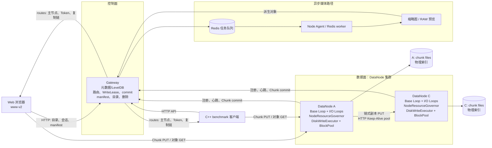
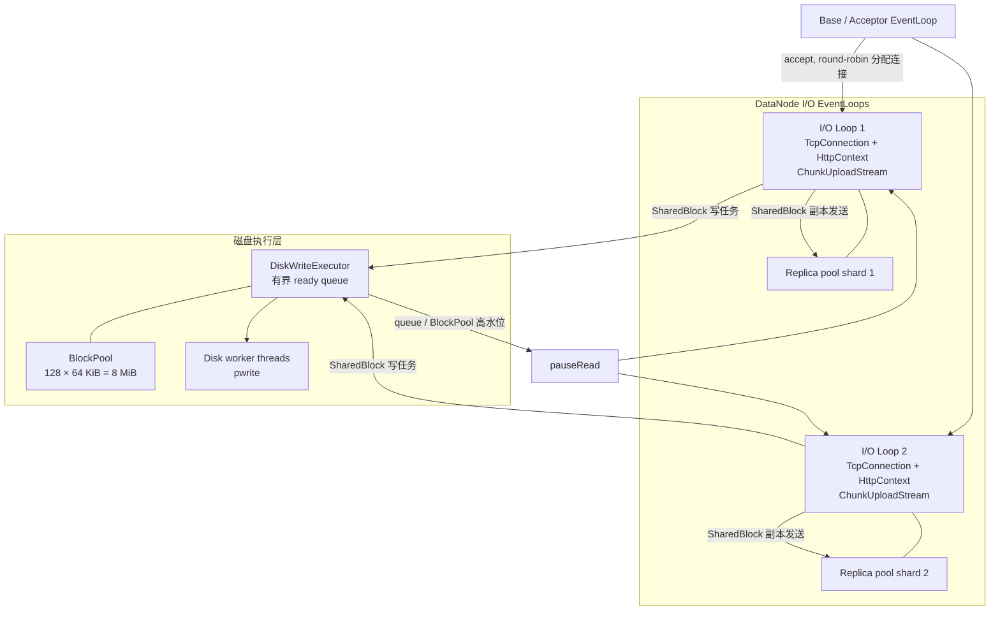
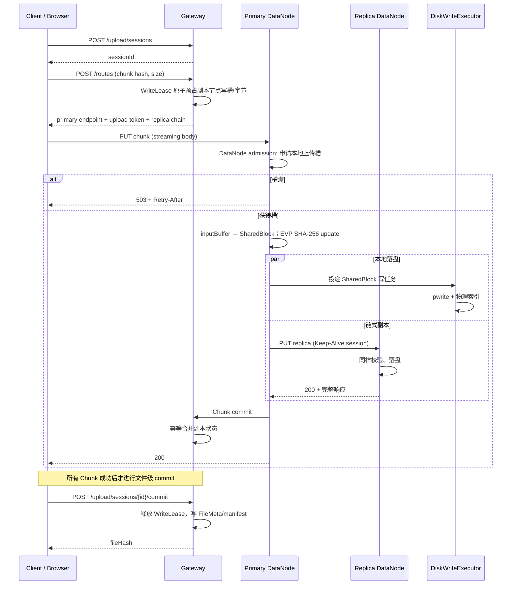
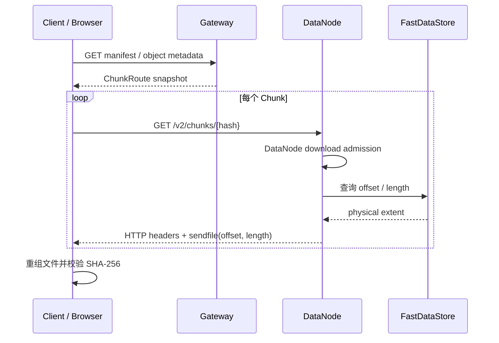

# MiniKVCine V4：最终架构、关键时序与性能报告（2026-08-12）

## 项目定位

MiniKVCine 是一个 C++17 分布式对象存储原型。它面向大文件与媒体对象，支持流式分块上传、
链式双副本、断点续传、目录/对象元数据、缩略图异步处理以及 Web 管理界面。

V4 的重点是把“能上传下载”推进为“有明确容量边界、背压、生命周期保护和可复现性能结论”的
数据面系统。

## 最终结论

- 已实现并验证 Gateway、DataNode、Node Agent 的多进程部署；DataNode 使用 Multi-Reactor 网络模型。
- 上传具备 SHA-256 校验、写入租约、Gateway/DataNode 双层准入、链式双副本和幂等 commit。
- 副本路径已从每 Chunk 短连接优化为有界 HTTP/1.1 Keep-Alive 会话池；Body 数据由有界
  SharedBodyBlock 同时供磁盘写和副本发送，避免副本 pending 队列重复复制。
- 默认双节点双副本、每节点 2 上传槽时，系统稳定接纳 2 个文件；满载时稳定返回
  `503 + Retry-After`，而不是发生无解释失败。
- 两节点、4 槽、每文件 window=2、全局 Chunk 预算=4 的 upload-only 实验达到
  **135.35 MiB/s aggregate 中位吞吐**；但 mixed c8 出现显著上传尾延迟，因此 4 槽仍只作为实验档。
- 当前高负载的主要瓶颈是磁盘写入尾延迟与由此产生的 BlockPool/HTTP 背压，不是 Gateway、epoll
  线程数量或用户态输出缓冲。

## 1. 系统部署架构



### 组件职责

| 组件 | 主要职责 |
|---|---|
| Gateway | 元数据、会话、分配副本链、WriteLease 预占、manifest、文件级 commit、目录/删除 |
| DataNode | 接收 Chunk、校验 SHA-256、磁盘写入、链式复制、本地 admission、sendfile 下载 |
| NodeResourceGovernor | 每节点与每客户端上传/下载槽，超载时返回可重试 503 |
| DiskWriteExecutor / BlockPool | 有界异步 pwrite 与固定内存池；高水位时触发 pause/resume |
| ReplicaConnectionPool | 按目标 endpoint 和 owner EventLoop 分片的 HTTP Keep-Alive 会话池 |
| Node Agent | 消费 Redis 媒体任务，生成缩略图、RAW 预览等派生对象 |

## 2. DataNode 线程与资源边界



关键规则：

- 一个 `TcpConnection` 固定归属一个 I/O EventLoop，不能跨 Loop 直接操作。
- 一个副本 HTTP/1.1 会话同一时刻只处理一个请求；连接只能回到其 owner Loop 的 pool shard。
- `SharedBlock` 在磁盘 worker 与副本发送都释放后才归还 BlockPool。
- BlockPool 或磁盘任务队列达到高水位时，暂停 TCP 读；资源恢复后再 resume，避免内存无界增长。

## 3. 上传关键时序



### Chunk window 与全局预算

```text
每文件 window：同一文件同时可以发起多少个 routes + PUT
全局 Chunk budget：多个文件合计最多多少个 Chunk 在飞
服务端写槽：最终允许多少个写入被节点接纳
```

三层缺一不可。以双节点、双副本为例，两个文件各 window=2 会产生最多 4 个在飞 Chunk；若服务端
仍为每节点 2 槽，应把客户端全局预算限制为 2，否则 Gateway 正确返回 503。

## 4. 下载关键时序



下载使用 extent + `sendfile`，避免把 chunk 完整读入用户态输出 Buffer；但下载仍和上传共享 CPU、
页缓存与磁盘，因此 mixed 负载必须作为独立质量测试。

## 5. 最终性能结果

### 5.1 默认稳定档

双 DataNode、双副本、每节点上传槽=2、16 MiB、I/O Loops=2：

| 文件并发 | 成功/请求 | 上传 P50 | 下载 P50 | 说明 |
|---:|---:|---:|---:|---|
| 1 | 3/3 | 344.622 ms / 46.43 MiB/s | 150.872 ms / 106.05 MiB/s | V4.2 基线 |
| 2 | 6/6 | 277.360 ms / 57.69 MiB/s | 168.296 ms / 95.07 MiB/s | 稳定即时容量 |
| 4 | 6/12 | 成功流 240.000 ms | 成功流 160.484 ms | 每轮 2 个预期 503 |
| 8 | 6/24 | 成功流 277.217 ms | 成功流 187.117 ms | 每轮 6 个预期 503 |

双副本下即时文件容量近似为：

```text
DataNode 数 × 每节点上传槽 ÷ 副本数
```

因此默认双节点为 `2 × 2 ÷ 2 = 2` 个文件。该限制是保护策略，不是数据损坏。

### 5.2 已验证优化结果

| 优化 | 直接证据 | 结论 |
|---|---|---|
| 副本长连接池 | 生产日志出现 created 后 reused | 消除每 Chunk 固定建连/关闭；主要改善尾部与 CPU |
| SharedBodyBlock | 磁盘/副本共同持有固定 Block | 消除副本 pending `std::string` 复制，内存仍有固定上限 |
| window=2 + 全局预算 | 默认两槽单文件 P50 354.467 → 127.236 ms | 消除单文件串行空洞；必须受全局容量治理 |
| 四槽高吞吐实验 | 2 文件 × window=2 × budget=4 aggregate 中位 135.35 MiB/s | upload-only 有效，mixed 仍需限流 |

### 5.3 四槽 mixed 的质量边界

四槽、window=2、global budget=4、mixed c8（4 上传 + 4 下载）两次均成功，但独立复测：

| 指标 | 结果 |
|---|---:|
| 上传 P50 / P95 | 664.151 / 945.215 ms |
| 下载 P50 / P95 | 255.231 / 291.260 ms |
| Chunk total P50 / P95 / P99 | 52 / 420 / 464 ms |
| pwrite P50 / P95 / P99 | 7.007 / 210.563 / 415.202 ms |
| BlockPool 精确峰值 | 8 MiB / 8 MiB |
| 单 pipeline 最大 disk pause | 7 次、418 ms |
| routes P50 / P95 | 28 / 80 µs |

结论：服务端准入和背压正确工作，系统没有失控；但磁盘写尾延迟通过 BlockPool/暂停读取向上传
文件延迟传播。因此四槽是“可完成”的容量档，尚不是默认 SLA 档。

## 6. 瓶颈判断与剩余工作


当前不应优先做的事情：增加 EventLoop、扩大 BlockPool、继续增加 window 或默认写槽。现有证据表明
它们会提高压力上限，却不消除高 mixed 下的根因。

后续优化优先级：

1. 为 DiskWriteExecutor 增加任务 queue-wait、worker busy-time 和 pwrite 直方图。
2. 在固定高吞吐配置下，比较 64/128/256 KiB Block 与 1/2/3 个磁盘 worker；只接受吞吐上升且
   pwrite/Chunk P95、pause、RSS 不恶化的组合。
3. 将上传、下载、副本、媒体后台任务改为有界加权/轮转调度，避免某一类任务挤压其他前台请求。
4. 把客户端全局 Chunk 预算改为按文件 round-robin，改善多文件进度公平性。
5. 完善 SHA 指令路径验证、`writev` partial-write、连接池 idle TTL/退避/半开探测，并在跨机网络复测。

## 7. 正确性、测试与报告索引

- 全量 CTest：47/48 通过；唯一失败为 UI Python 依赖 `playwright` 缺失。
- 成功上传下载对象均由客户端执行完整 SHA-256 校验。
- 重点网络生命周期测试、连接池、SharedBodyBlock、DiskWriteExecutor、Chunk pipeline 均已覆盖回归。

详细证据：

- [V4.2 容量与性能基线](V4_2_CLUSTER_CAPACITY_TEST_REPORT_2026-08-11.md)
- [Stage 0 综合观测](V4_3_STAGE0_COMPREHENSIVE_PERFORMANCE_ASSESSMENT_2026-08-11.md)
- [副本连接池](V4_3_REPLICA_CONNECTION_POOL_REPORT_2026-08-12.md)
- [SharedBodyBlock](V4_3_SHARED_BODY_BLOCK_REPORT_2026-08-12.md)
- [Chunk window](V4_3_CHUNK_WINDOW_REPORT_2026-08-12.md)
- [四槽容量边界](V4_3_FOUR_SLOT_CHUNK_CAPACITY_REPORT_2026-08-12.md)
- [完整优化路线](V4_3_CURRENT_PERFORMANCE_ANALYSIS_AND_OPTIMIZATION_ROADMAP_2026-08-12.md)

## 面试版项目表述

> 基于 C++17 实现分布式对象存储 MiniKVCine：设计 Gateway/DataNode 链式双副本架构，完成
> 4 MiB 流式分块上传、SHA-256 校验、断点续传、写入租约与双层资源准入；实现 Multi-Reactor、
> 有界磁盘写队列、HTTP pause/resume、sendfile 下载、副本连接池和 SharedBodyBlock。通过真实磁盘
> 压测建立吞吐、P50/P95/P99、背压、BlockPool 与 EventLoop 指标，定位 mixed 高并发下磁盘写尾延迟，
> 并验证高吞吐与稳定配置的容量边界。
