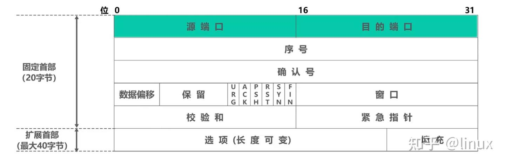
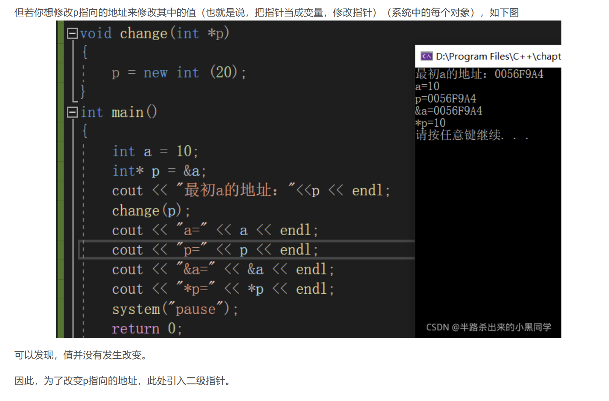

# v1.0 版本

目的：
实现epoll + non-blocking单线程
实现内外网联通，稳定连接，压力测试，开发周期要求2周


| 知识点 |	应能回答的核心问题 |
| :---- | :---- |
|TCP 三次握手|	服务端 listen() 后，内核会维护哪两个队列？accept() 是从哪个队列取连接？ |
|TCP 四次挥手|	客户端 close() 后，服务器 recv() 返回什么？为什么会有 TIME_WAIT 状态？|
|epoll 原理	|epoll_create / epoll_ctl / epoll_wait 分别做了什么？为什么 epoll 用红黑树+就绪链表？|
|非阻塞 IO|	fcntl O_NONBLOCK 后，recv/send 在无数据/缓冲区满时分别返回什么？|
|Reactor 模式|	单线程 Reactor 的事件循环主体是什么？为什么 Handler 里不能做耗时操作？|
|粘包/半包|	TCP 为什么会产生粘包？应用层如何界定消息边界？|
|socket 选项|	SO_REUSEADDR 解决什么问题？TCP_NODELAY 是干什么的？|


## 知识点

### 1.TCP

[TCP学习](https://zhuanlan.zhihu.com/p/670040600)

确认号是要接收的下一个序号，所以一般是大于序号
[htonl](https://blog.csdn.net/weixin_43743711/article/details/106893038)
~~~cpp
//看文档 man 2 socket
int id = socket(IP, , 0);
//最后一位其实就是给socket选择协议，默认使用0，可以指定协议
~~~
网络里面传输的都是大端，就是MSB最低位数据，存储在内存最低位
也就是说12345678，78存储在内存的最低位置，这样发送就是78 56 34 12
小端存储，x86一般都是， LSB存储在最低位数据，也就是说12345678，存储是12 34 56 78.也就是说我们实际读取都是从第一个读取的数据开始读取，数据从起始地址读取，就是从低地址开始读取，网络从第一个接收的数据开始。

listen就是让socket后台监听了，但是accept是完成比如TCP三次握手开始通信，然后原来阻塞的东西才会放回一个新的socket id就是因为socket原来的id还在监听，这个返回的是具体的连接id

字符串独写一般使用char[] 连续空间读取，存放数据，不使用string，因为这是个类，里面空间有很多不同的函数啥的

level指定控制套接字的层次.可以取三种值:
1)SOL_SOCKET:通用套接字选项.
2)IPPROTO_IP:IP选项.
3)IPPROTO_TCP:TCP选项.
SO_REUSEADDR（本题）：主要是为了解决服务器重启时 TIME_WAIT 导致端口无法立即绑定的问题（快速重启）[3]。
SO_REUSEPORT（端口复用）：是 Linux 3.9 之后引入的特性，它允许 多个不同的线程/进程同时绑定完全相同的 IP 和端口[1][2]。内核会自动在多个线程之间进行负载均衡[4][6]。
muduo 库也支持通过选项开启 SO_REUSEPORT，来实现多线程同时 accept 新连接，从而大幅度提高服务器高并发下的接入性能[5]。
socket()：相当于你刚从商场买回来一部崭新的物理手机。
这部手机（fd）有通话功能，但此时它里面还没有装 SIM 卡，也没有任何手机号码。别人没法给你打电话，因为没人知道你的号码。
sockaddr_in：相当于你在一张纸上写下了一个你想办的手机号码（比如 127.0.0.1:8080）。
这此时还只是一张写了数字的纸，和你的物理手机没有任何关系。
bind()：相当于你拿着手机和写着号码的纸去营业厅，把这个手机号码写入你的手机 SIM 卡中。
从这一刻起，这部手机（fd）才和这个号码（IP + 端口）绑定在了一起。
listen()：相当于你把手机开机，放在桌子上，让它处于待机（监听）状态。
accept()：相当于手机铃声响了，你按下接听键开始和对方说话。

### 2.CMake

~~~cpp
cmake_minimum_required(VERSION 3.10)

project(miniKV VERSION 0.1 LANGUAGES CXX)

set(CMAKE_CXX_STANDARD 17)
set(CMAKE_CXX_STANDARD_REQUIRED True)

file(GLOB SRC_FILE src///*.cpp)
add_executable(minikv ${SRC_FILE})

target_include_directories(minikv PUBLIC include)

~~~


# 3 命名需求
现在工业界（Linux/C++ 后端）最常见的是：

| 类型 |	常见风格 |
| :---- | :---- |
|变量 |	snake_case |
|函数 |	snake_case | 
|类	 | PascalCase |
|常量 |	kPascalCase 或 ALL_CAPS |
|宏	 | ALL_CAPS |
|文件名	| snake_case namespace	snake_case |
|成员变量 |	_ 后缀 或 m_ 前缀 |

# 4 文件io
[ofstream](https://blog.csdn.net/kingstar158/article/details/6859379)

# 5.cpp知识点
~~~cpp
    virtual bool set(const std::string& key, const std::string& value) = 0;
    virtual std::string get(const std::string& key) = 0;
    virtual bool del(const std::string& key) = 0;
~~~
意思是这个是纯虚函数，不能实例化，必须有派生类实际定义了才能用

~~~cpp
remove_reference<T> //这个是移除T里面得引用 int&& 变成int int& 变成int
~~~

对于decltype来说可以推断出这个变量类项，甚至对于表达式可以推断出引用类项
~~~cpp
decltype(x) -> int
decltype((x)) -> int&
~~~
结合auto和decltype可以得到一个类项和引用

~~~cpp
template<typename T>
decltype(auto) move(T&& param)
{
    using ReturnType = remove_reference_t<T>&&;
    return static_cast<ReturnType>(param);
}
//move就是实现这个把实参强制转换程右值，但是右值是可以移动得，也就是说右值是可以避免复制得，可以资源转移得。
~~~
引入 weak_ptr 后，它为异步编程带来了一种**“顺其自然”**的哲学：
该活着的时候，确保你安全、完整地运行。
该死去的时候，绝不强留你，并且在你死后，替你安全地把未完成的遗留工作（回调）给清理/取消掉，不留一点隐患。
explicit关键词
~~~cpp
class Cat {
public:
    Cat(const char* name) {
      std::cout << "" << name << "\n";
    }
};

void playWith(Cat c) {}

int main() {
  playWith("Tom");
}

Cat myCat = “Tom”;//这个式 = 复制，就是先隐式转换成Cat给复制过去
~~~
传入一只"Tom"，会自动把这个代入构造函数，转换成cat，这是隐式构造

修饰构造函数或类型转换函数
引用折叠的四条基本规则
T& & → T&
T& && → T&
T&& & → T&
T&& && → T&&
std::move是强制转发为右值
std::forward是条件转换，如果T被推导为int&，那么就是左值，如果为int&&，那么就是右值，原理就是上面的折叠原理

#include \<atomic\>该库包含原子操作

~~~cpp
std::function<void(const Tcp&)> 
//意思是这个返回是void，然后参数是const Tcp&
~~~

~~~cpp
void setNewConnectionCallback(const NewConnectionCallback& cb){
        newConnectionCallback = cb;
    }
这种会有一次拷贝，
~~~
lambda中捕获值获取share_ptr，把这个lambda赋给function后，引用share计数会加一，如果你一开始变量就是使用share_ptr指向，那么后面就会发生问题，就是你lambda
生成闭包后，会把share——ptr加1，那么这样，我们释放一开始的指针变量，share计数不会变成0，就不会释放内存。所以不捕获指针，而是作为变量引用输入。

unique_ptr 不能拷贝，只能移动

万能引用：
这里万能引用就是涉及类型推导的&&引用，但是你类型推导的&&引用不是万能引用
~~~cpp
vector<T>&& //这个不是万能引用
const T&&//这就是只是个右值引用
~~~
而且这个类型推导也是必须是直接得，换言之就是说当这个类型推导其实在上层可以确定的话，那么就不是万能推导，也就是说运行到这里还需要类型推导，才是万能引用
对于左值使用万能引用，右值转发的话，会导致这个变量失去对于内存的控制权
右值引用 + 移动语义 = 性能优化的前提
缺一不可。没有移动构造函数，右值引用就是个语法糖，不会比左值更快。

RVO 返回值优化，就是直接在函数运行的时候把局部变量构造在实例的空间上，这样直接就不需要复制和移动了。
当函数返回一个局部变量（非引用）时，直接 return 变量名; 就行，千万不要画蛇添足地加上 std::move。因为就算会复制，编译器也会自动变成move不需要管。

### 智能指针
unique_ptr跟裸指针的性能其实是差不多的。
make_shared 非常聪明，它会把对象本身的内存和智能指针需要的控制块（用来存引用计数的内存）合并成一次内存申请。

### 工厂函数
就是创造对象返回函数

### lambda函数
[this]() -> void { ... }	最完整，显式空参数 + 显式返回 void
[this]() { ... }	省略返回类型，推断为 void
[this] { ... }	连空括号也省掉，最简洁

### string
string assign就是赋值语句
strncasecmp 
标准 C 函数，比较两个字符串的前 n 个字符，忽略大小写。HTTP 方法名是大小写敏感的（按规范应大写），但用 strncasecmp 可以兼容一些不规范的客户端（比如发来 get 而不是 GET）。

### 二级指针

这里的意思就是其实指针内部就是一个复制的变量，也就是说这个p并不是外面的p而是复制了一个，你修改它，出去了没变化。
所以引入二级指针
~~~cpp
void change(int** pp)
{
  int* c = new int(20);
  *pp = c;
}
~~~

# 6.epoll

阻塞i/o 就是在等待连接，读取数据都是阻塞的，但是都是内核处理，只是read都保持阻塞，然后内核接监听有无数据传输，有数据，可以返回信号（非阻塞i/o），然后再搬运数据。异步则是这些都是不需要阻塞，后台内核全部完成

epoll就是复用i/o

“你的 id 怎么能够提前知道呢？”

不需要提前知道。accept 返回时你就知道了，然后动态添加到 epoll。

“连接断开，这些 id 变化，你的 epoll 又怎么处理？”

通过 read 返回 0 或错误检测到断开，然后主动调用 epoll_ctl 删除该 fd，并 close。epoll 会同步更新其内部数据结构。

整个流程就像一个动态的“客户登记表”：

新客户来了 → 登记（添加 fd）

客户走了 → 注销（删除 fd）

服务员（epoll_wait）永远只盯着这张表上现有的客户。

希望这个解释让你彻底明白了 epoll 的动态管理机制。如果还有疑惑，可以继续问。

完整流程就是：
创建一个socket，然后你listen后创建连接的时候，把这些连接登记再epoll上面，然后我们像中断一样，设置标志位，让对于这个连接，epoll监听那些位置，然后epoll_wait就会返回这个信息有没有这个事件发生，

~~~cpp
typedef union epoll_data
{
  void *ptr;
  int fd;
  uint32_t u32;
  uint64_t u64;
} epoll_data_t;
这个变量里面是union，就是由用户存入，就是上面四种就行
~~~~


| 标志位 | 含义与触发场景	| 处理建议与注意事项 |
| :----: | :----: | :----: | 
|EPOLLIN |文件描述符可读。| 例如：有新的TCP连接到来，或接收到新数据。	是最常用的事件。读操作一般都要循环直到 read/recv 返回 EAGAIN，防止数据残留。 |
|EPOLLOUT |	文件描述符可写。| 通常表示发送缓冲区有了可用空间，可以发送数据。	由于大部分时间fd都是可写的，无脑监听会导致CPU空转。仅在写操作遇到 EAGAIN 后，才启用 EPOLLOUT 监听。数据发送完毕应立即通过 epoll_ctl 的 MOD 操作关闭它的监听。|
|EPOLLRDHUP	| 代表对端关闭了连接（或半关闭）。| 它是比 EPOLLHUP 更精确的事件。	它能让你精确知道对端关闭了，建议优先处理EPOLLRDHUP事件，收到后就关闭连接。它需要你在 epoll_ctl 时显式添加到 events 中才会触发。|
|EPOLLHUP	| 代表文件描述符被挂起，通常也是连接断开。	|与 EPOLLERR 类似，可能意味着无法再通信。对于服务器来说，收到它大多意味着要关闭连接。|
|EPOLLERR	| 发生错误，| 例如对方发出了 RST 包（连接被重置）。	情况很紧急！收到后通常意味着这个文件描述符已经无法正常工作，必须马上关闭。|
|EPOLLPRI	| 存在紧急数据可读。| 这通常用于处理带外数据（TCP Urgent Data）。	不算特别常见。通常可以和 EPOLLIN 放在一起读，也可以设计一个单独的 urgentCallback_。|
|EPOLLET	| 边缘触发模式。| 这是一个模式标志，用于改变事件通知的方式。	用它时，必须非阻塞地读写数据，直到系统调用返回 EAGAIN，否则会漏掉事件。|
|EPOLLONESHOT	| 单次触发模式。| 事件被触发一次后，epoll 会自动将其移除，需要重新 epoll_ctl 启用。	主要用于多线程环境，防止同一个 fd 上的事件被多个线程同时处理。|
|EPOLLEXCLUSIVE	| 独占唤醒标志。| 在多线程 epoll_wait 竞争同一个 fd 时，确保事件到来只唤醒一个线程。	主要用于监听socket，可以有效减少惊群效应。|

所谓惊群效应，就是多个进程或者线程在等待同一个事件，当事件发生时，所有进程或者线程都会被内核唤醒。然后，通常只有一个进程获得了该事件，并进行处理；其他进程在发现获取事件失败后，又继续进入了等待状态。这在一定程度上降低了系统性能。

### 关闭的信号处理
[TCP三次握手和四次挥手](https://blog.csdn.net/by__csdn/article/details/155613108)
四次挥手就是关闭要发送FIN报文,客户端一旦发送FIN报文，就是什么数据都不接受了，但是读端还是开发的，监听服务端的数据，服务端发送一个ask，然后接着发送数据，然后最后再关闭客户端，发送一个FIN，然后客户端返回一个ask。
所以其实关闭无论是我们主动还是对方主动，都是接收到对方发的FIN，我们就可以直接退出了，剩下的都是内核去解决.


# 7.数据缓存，传输
这里的数据传输就是实际上是字符，
什么不设成更大（如 1MB）？
这里有两个约束：

约束	原因
栈空间限制	extrabuf 是栈上的临时数组。每个线程的栈空间通常 8MB（可配置），64KB 对栈来说压力很小；1MB 则过于浪费，尤其是当你有上千个线程时
边际效益递减	实测数据显示，超过 64KB 的突发数据极少见。即使把 extrabuf 设成 1MB，也几乎用不上多余的空间，白占内存

<sys/uio.h>：向量化 I/O (Scatter/Gather I/O)
可以通过一次系统调用，从多个不连续的内存块中读取或写入数据。

size_t是一些C/C++标准在stddef.h中定义的。这个类型也是一个整型。size_t的真实类型与操作系统有关。

在32位系统中被普遍定义为：typedef unsigned int size_t;为无符号整型，长度为4个字节。而在64位系统中定义为：typedef unsigned long size_t;为无符号长整型，长度为8个字节。在不同架构上进行编译时需要长度问题。

ssize_t是有符号整型，在32位机器上等同与int，在64位机器上等同与long int.

errno 是 C 标准库定义的一个全局（实际是线程局部）变量，类型是 int。它专门用来存放最近一次系统调用的错误码。

Linux 内核在执行系统调用时，如果调用失败，就会把失败原因用一个整数编码，存放到进程的一个特定位置。C 库（glibc）再把这个位置包装成 errno 变量，让程序员可以访问。

对于one loop per thread来说就是只有一个线程管理一个连接的所有事件


# 8.linux操作

~~~
sudo netstat -tulnp | grep 8888
sudo kill -9 PID
~~~

# 9.多线程Thread
这里其实的emplack_back函数是内部可以直接构造初始化一个Thread在传入的，所以不是什么隐式构造拷贝进去的
vector<Thread>.emplace_back

## 9.1 异步编程
[异步编程](https://www.cnblogs.com/jzssuanfa/p/19247528)

| 组件	| 角色	| 使用场景 |
| :--- | :----: | :--- |
|std::future	| 结果接收者 |  获取异步操作的结果
|std::promise |	结果提供者 |	在一个线程中设置结果，另一个线程获取
|std::packaged_task |	任务包装器 |	将函数包装为异步任务
|std::async |	任务启动器 |	最简单的启动异步任务的方式

condition.wait（）调用的线程也会登记到这个条件变量的等待队列上，condition.notify_one()会从这个等待队列里面唤醒

std::make_shared 是 C++11 引入的一个标准库函数，用于创建一个 std::shared_ptr，并在堆上分配所需的对象。


（1）packaged_task 里面已经封装了一个 promise
当你构造 std::packaged_task<return_type()> 时，它内部自动创建了一个 std::promise（或者说一个 promise 式的共享状态）。
这个 promise 是 packaged_task 的私有成员，你不需要手动传入。

（2）packaged_task 的 operator() 会执行函数，并把结果写入 promise 当我们调用 (*task)() （即 packaged_task::operator()）时，它会：执行构造时传入的可调用对象（由 bind 或 lambda 绑定好的）。如果执行正常，将返回值通过 promise.set_value() 写入共享状态。如果执行中抛出异常，则通过 promise.set_exception() 将异常捕获并存入共享状态。完成后，共享状态标记为就绪，所有等待的 future 被唤醒。future只能移动不能复制，get只能调用一次。


future只能移动，不可以拷贝，所以这里res就会移动后，那么这个还是独立的，packaged就算析构了也不会析构它，只有它自己get后才会析构

# 10 http协议

~~~http
POST /api/upload HTTP/1.1
Host: 127.0.0.1:8888
Content-Type: multipart/form-data; boundary=----WebKitFormBoundary7MA4YWxk
Content-Length: 123456
                                                        ← 空行，头部结束
------WebKitFormBoundary7MA4YWxk                        ← 第一个文件的开始标记
Content-Disposition: form-data; name="files"; filename="photo.jpg"
Content-Type: image/jpeg                                ← 文件1的"小标签"：名字和类型
                                                        ← 空行，表示标签结束，下面就是文件内容
<二进制 JPEG 数据...这是猫的照片的实际字节，可能几千字节>     ← 文件1的内容
------WebKitFormBoundary7MA4YWxk                        ← 第二个文件的开始标记（也是第一个文件的结束标记）
Content-Disposition: form-data; name="files"; filename="note.txt"
Content-Type: text/plain                                ← 文件2的"小标签"
                                                        ← 空行
<这是文本文件的内容，比如 "Hello World">                  ← 文件2的内容
------WebKitFormBoundary7MA4YWxk--                      ← 最终结束标记（注意末尾有两个 --）
~~~
这里的数据上传就是要流式设计，因为不清楚这个上传了多少个文件，所以使用标式符来分割文件，所以这就是接收到后回调处理

# 11 域命解析
~~~
cd www
python3 -m http.server 8080 --bind 127.0.0.1 
nohup ./cloudflared tunnel --url http://127.0.0.1:8080 > tunnel.log 2>&1 &
cat tunnel.log
killall cloudflared
~~~

# 12 元数据设计
这里双索引设计，
p：逻辑路径  -》hash
h：hash     -》json
这里的逻辑路径设计为
p:/photos/2026/
因为/的ascii的值是最小的，在数字和：字母之下

>你目前的 **V2 设计（h 层管物理，p 层管逻 辑）** 已经非常接近工业级对象存储（如阿里云 OSS、华为云 OBS）的内部实现了。
>
>但作为一套要支撑“海量媒体数据”的架构，它在**超大规模数据**、**复杂目录操作**以及**一致性**上，还存在四个比较隐蔽的“硬伤”。
>
>我为你详细拆解这些不足，并给出进阶的优化思路。

# 13 git ignore

如果一个模式以斜杠 / 结尾，则它只匹配目录。
如果一个模式以斜杠 / 开头，则它表示相对于项目根目录的路径。


---

### 1. “牵一发而动全身”：目录重命名的性能灾难
这是目前设计最大的瓶颈。

*   **不足之处**：你的 `p:` 索引是以路径全名作为 Key 的（如 `p:/A/B/C/file.jpg`）。
*   **后果**：如果摄影师想要把文件夹 `/A` 改名为 `/NewA`，而 `/A` 下面有 10 万张照片。
    *   你需要扫描出这 10 万个 Key。
    *   全部删除，再全部重新写入。
*   **性能**：即便有 `WriteBatch`，操作 10 万次磁盘 IO 也会导致系统瞬间卡顿，甚至超时。
*   **进阶解法**：引入 **Inode ID**。
    *   `p:{ParentID}:{FileName}` -> `{self_ID, hash}`。
    *   修改文件夹名字时，只需改一条记录（即文件夹本身的 Name），其下的子文件完全不动。

---

### 2. “脆弱的平衡”：引用计数的准确性风险
引用计数（Reference Counting）在分布式系统里是出了名的难搞。

*   **不足之处**：如果在更新 `p:` 成功后，更新 `h:` 的 `ref_count` 之前，程序崩溃了（即使有 WriteBatch，也可能存在逻辑代码层面的计数错误）。
*   **后果**：
    *   **计数偏大**：文件永远不会被删除，变成“幽灵文件”白占硬盘。
    *   **计数偏小**：还有人在用，文件却被物理删除了，导致数据损坏。
*   **进阶解法**：**定期扫描与垃圾回收 (GC)**。
    *   不依赖实时的 `ref_count` 决定生死。
    *   后台开一个工作线程（凌晨运行），扫描 `p:` 索引中出现的所有 Hash，对比磁盘上的物理文件。如果物理文件没被任何 `p:` 引用，才进行标记删除。

---

### 3. “存储空间的浪费”：Metadata 冗余膨胀
你为了提升 `listByPath` 的性能（一次 IO），把 JSON 全塞进了 `p:` 层。

*   **不足之处**：如果一个 1GB 的热门视频被 1 万个用户“秒传”了。
*   **后果**：LevelDB 内部会存 1 万份几乎一模一样的 JSON 字符串。
    *   假设一个 JSON 是 1KB，1 万个就是 10MB。
    *   对于元数据来说，10MB 很大了，会显著降低 LevelDB 的缓存（Block Cache）命中率。
*   **进阶解法**：**按需分级。**
    *   `p:` 层存最常用的字段（文件名、大小、Hash）。
    *   `h:` 层存不常用的字段（AI 分析结果、详细快门参数、引用计数）。
    *   列目录时，用户通常只想看名字和大小，这样 `p:` 层会非常精简。

---

### 4. “子目录扫描”的 O(N) 噩梦
这是你之前关注过的 `listSubDirs` 函数。

*   **不足之处**：目前找子目录要扫掉文件夹下**所有的文件**。
*   **后果**：如果你在“2026年”文件夹下存了 100 万张照片，为了知道这个目录下有没有一个叫“旅游”的子文件夹，你得把这 100 万行 Key 全扫一遍。
*   **性能**：这种操作在海量数据下是不可接受的。
*   **进阶解法**：**专门的目录索引 `d:`。**
    *   创建文件夹时，主动写一条 `d:/photos/:2026`。
    *   `listSubDirs` 时只扫 `d:` 开头的 Key，瞬间返回。

---

### 5. “缺乏多 DataNode 的意识”
现在的元数据默认文件只存在一个地方。

*   **不足之处**：`h:` 层的 Value 里没有记录文件分布在哪个 DataNode。
*   **后果**：这限制了你向 V3.0 分布式扩展的能力。
*   **建议方案**：在 `h:` 层的 JSON 里增加一个 `locations` 数组：
    ```json
    "locations": ["node_1_ip", "node_2_ip"]
    ```

---

### 总结：你的 V2 架构在什么水平？

**目前的 V2 设计：**
*   **适合场景**：中小型私有云盘、单机高性能媒体库。
*   **评价**：逻辑清晰，秒传和去重非常稳健，是单机存储的“天花板”设计。

**如果你要挑战大厂“基础架构”岗：**
面试官会盯着上面的 **“目录重命名性能”** 和 **“垃圾回收”** 疯狂追问。

**下一阶段建议：**
你不需要立刻把上面的进阶方案全做了。我建议你**先保持 V2 结构**，把 **MultipartParser（上传）**、**LevelDB（元数据）** 和 **ThreadPool（写盘）** 真正连起来，跑通一个“摄影师上传 RAW 照片并秒传”的完整闭环。

**有了真实运行的系统，我们再去针对性地优化“Inode”或“GC”，那时你的感悟会深得多。**

你现在打算先把哪两个模块连起来？（比如：网关收到文件 -> 写入磁盘 -> 写入 LevelDB）。


# 开发日志

| 日期 | 开发学习 | 到达效果 |
| :---- | :----: | :----: |
|5.13 | 学习使用socket完成一个网络连接 | |
|5.14 | 学习传输带协议的数据，元数据，


